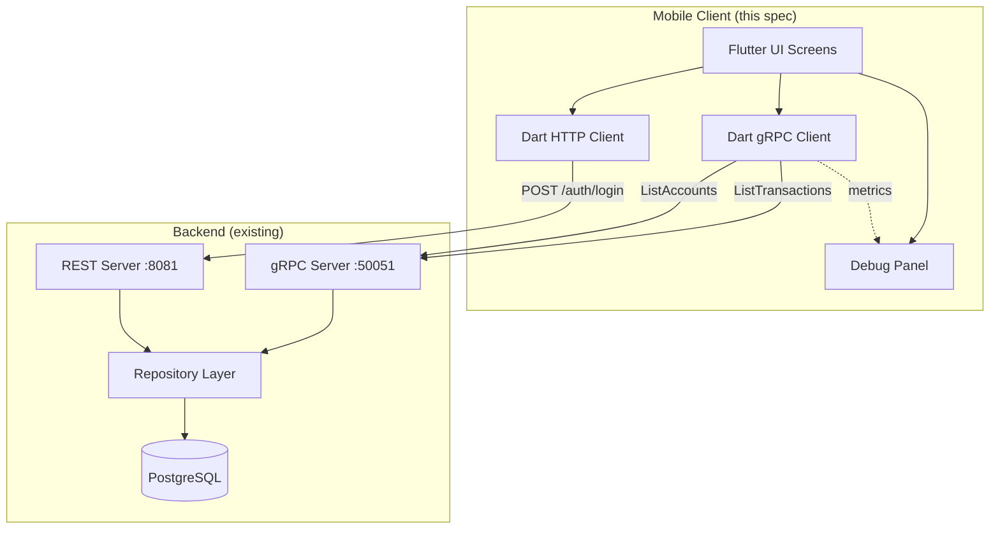
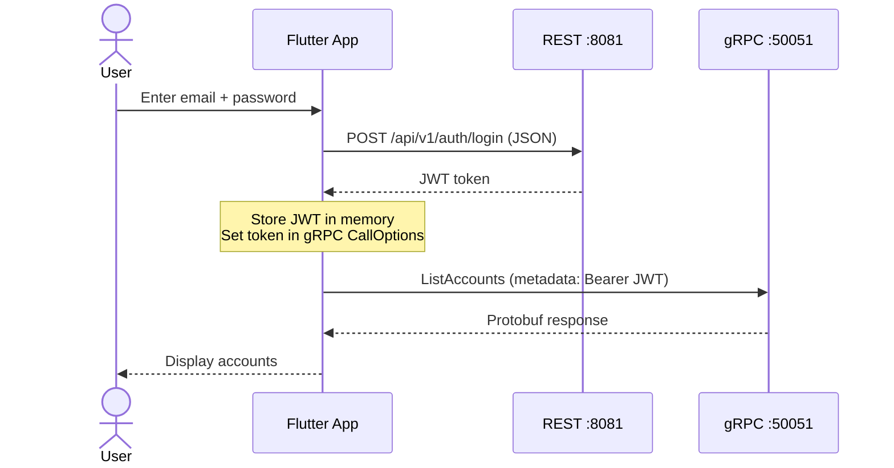
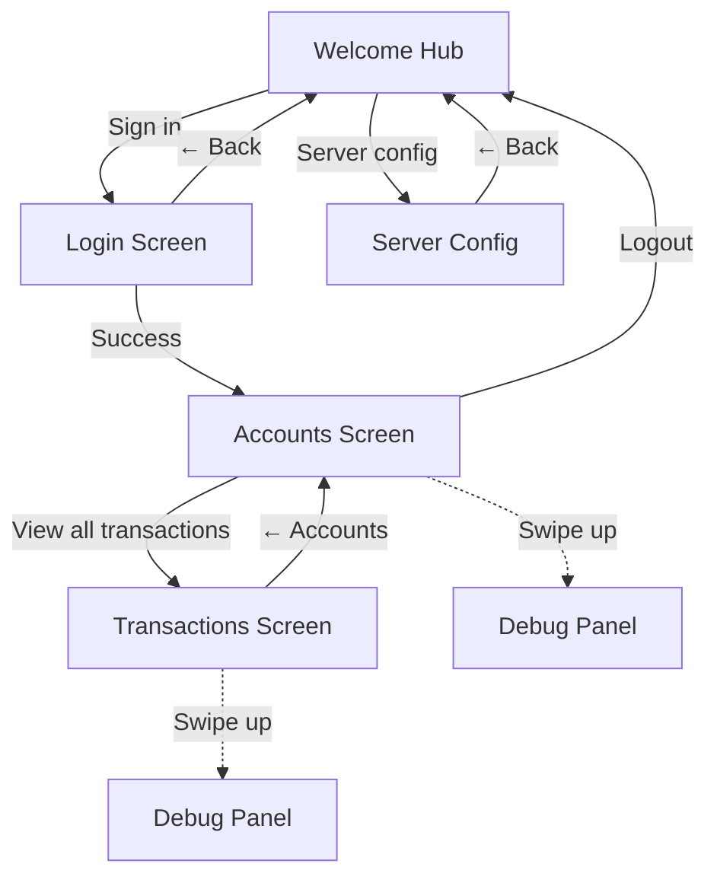
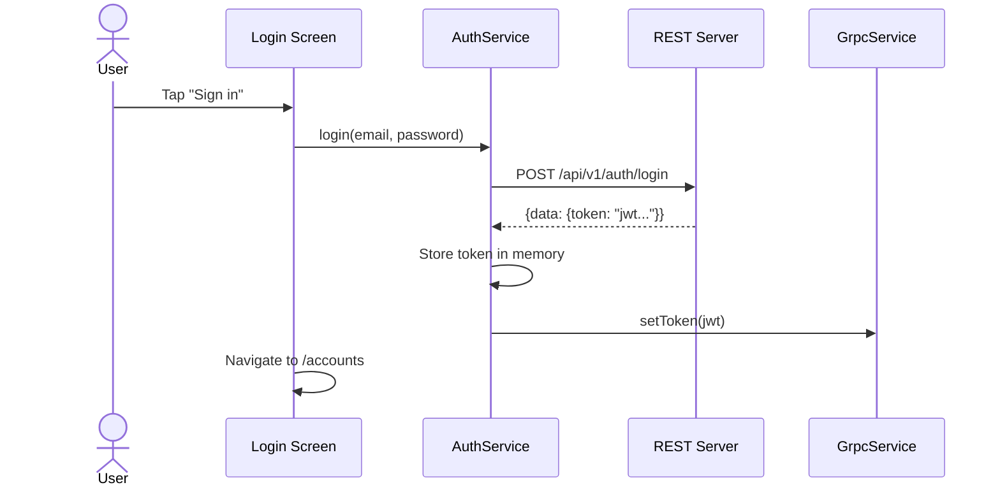
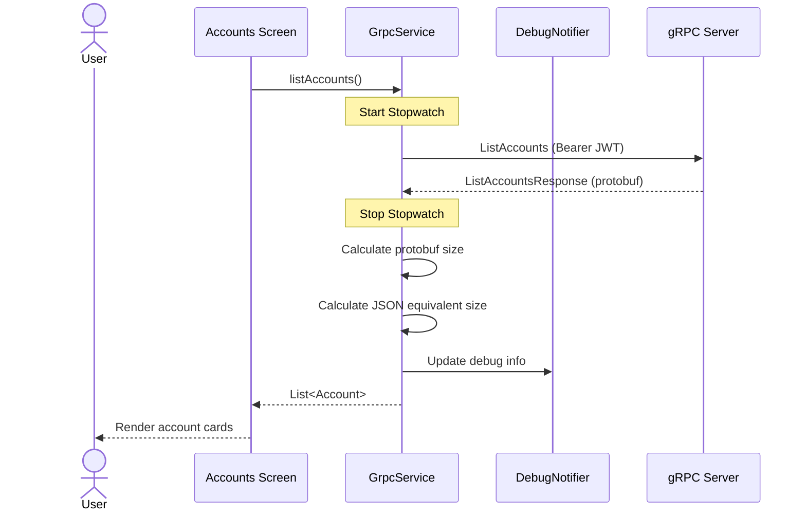
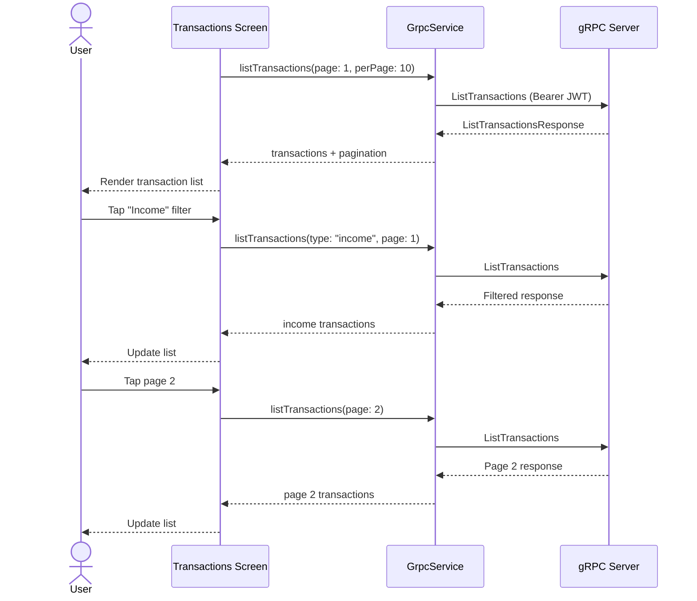
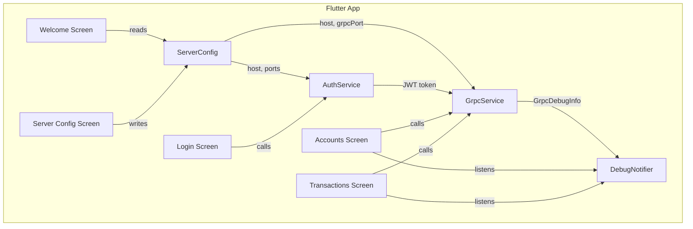
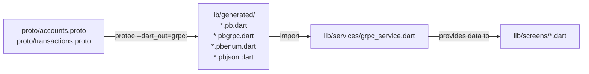

# Expense Tracker - Functional Specification (Flutter Mobile Client)

# 1. Document Overview
- **Document Owner:** Igor Kudinov — Business & System Analyst
- **Date / Version:** March 18, 2026 / v1.0
- **Version:** v0.4.0 — gRPC Mobile Client
- **Related Documents:** BRD v1.0, SRS MVP v1.0, TDD gRPC Integration v1.0
- **Related Initiatives:** Mobile Client Development, gRPC Demonstration

---

# 2. Executive Summary

This document specifies the functional design of the **Flutter mobile demo application** for the Expense Tracker system. The application serves as a working demonstration of gRPC client-server communication, connecting to the existing Go backend via Protocol Buffers for data retrieval while using REST for authentication.

**Purpose**

The mobile client is a **demo-grade application** built to:
1. Demonstrate end-to-end gRPC integration (proto → codegen → client → server)
2. Visualize Protocol Buffers efficiency via a real-time debug panel
3. Serve as portfolio evidence of full-stack mobile + gRPC implementation
4. Provide a working artifact for live demonstration of the system capabilities

**Scope**
- 5 screens: Welcome, Server Config, Login, Accounts, Transactions
- gRPC debug panel with payload comparison
- Read-only operations (ListAccounts, ListTransactions)
- iOS Simulator and Chrome (web) targets

**Out of Scope**
- Transaction creation/editing via mobile
- Offline mode or local caching
- Push notifications
- Production deployment to App Store / Google Play
- User registration flow

---

# 3. Architecture

## 3.1 System Context



## 3.2 Communication Protocols

| Operation | Protocol | Endpoint | Format |
|-----------|----------|----------|--------|
| Authentication | REST/HTTP | `POST /api/v1/auth/login` | JSON |
| List accounts | gRPC | `AccountService/ListAccounts` | Protocol Buffers |
| List transactions | gRPC | `TransactionService/ListTransactions` | Protocol Buffers |
| Connection test | gRPC | Channel establishment | — |

## 3.3 Authentication Flow



## 3.4 Technology Stack

| Layer | Technology | Version |
|-------|-----------|---------|
| Framework | Flutter | 3.41.4 |
| Language | Dart | 3.11 |
| gRPC client | `grpc` package | 5.1.0 |
| Protobuf runtime | `protobuf` package | 6.0.0 |
| HTTP client | `http` package | 1.6.0 |
| Local storage | `shared_preferences` | 2.5.4 |
| Code generation | `protoc` + `protoc-gen-dart` | 34.0 / 25.0.0 |

---

# 4. Navigation Flow

## 4.1 Screen Map



## 4.2 Route Configuration

| Route | Screen | Entry Condition |
|-------|--------|-----------------|
| `/` | Welcome | App launch (default) |
| `/server-config` | Server Config | Tap "Server config" button |
| `/login` | Login | Tap "Sign in" button |
| `/accounts` | Accounts | Successful authentication |
| `/transactions` | Transactions | Tap "View all transactions" |

---

# 5. Screen Specifications

## 5.1 Screen 0 — Welcome (Hub)

**Description**
Entry point of the application. Provides navigation to Sign In and Server Configuration. Displays current server connection status.


**Designs**
Centered vertical layout with app branding and two action buttons.


**Elements**
| Name | Type | Is editable | Is visible | Source | Description | Validation |
|------|------|-------------|------------|--------|-------------|------------|
| App Icon | Container | No | Yes | Static | Purple rounded square with "ET" text | — |
| App Title | Text | No | Yes | Static | "Expense Tracker" | — |
| App Subtitle | Text | No | Yes | Static | "gRPC mobile client" | — |
| Sign In Button | Button (primary) | Yes | Yes | Navigation | Navigate to Login screen | — |
| Server Config Button | Button (outlined) | Yes | Yes | Navigation | Navigate to Server Config screen | — |
| Server Address | Text | No | Yes | SharedPreferences | Current server IP:port (monospace) | — |
| Connection Indicator | Circle | No | Yes | gRPC channel state | Green (connected) / Red (disconnected) | — |

**Behavior**
- On app launch: load saved server config from `SharedPreferences`
- Attempt gRPC channel connection to saved server
- Display green dot if channel established, red if failed
- No authentication required to view this screen

**Modes and Configuration**
Single static screen. No user-configurable modes.

---


## 5.2 Screen 1 — Server Configuration

**Description**
Configure gRPC and REST server endpoints. Test connection before saving.


**Elements**
| Name | Type | Is editable | Is visible | Source | Description | Validation |
|------|------|-------------|------------|--------|-------------|------------|
| Server Address | Text Input | Yes | Yes | SharedPreferences | IP address or hostname | Required, non-empty |
| gRPC Port | Text Input | Yes | Yes | SharedPreferences | gRPC server port | Required, numeric, 1-65535 |
| REST Port | Text Input | Yes | Yes | SharedPreferences | REST API port (for auth) | Required, numeric, 1-65535 |
| Test Connection | Button (primary) | Yes | Yes | Action | Test both gRPC and REST connectivity | — |
| gRPC Status | Text + Icon | No | Conditional | Test result | "gRPC channel: connected/failed" | — |
| REST Status | Text + Icon | No | Conditional | Test result | "REST endpoint: reachable/failed" | — |
| Back Button | IconButton | Yes | Yes | Navigation | Return to Welcome screen | — |

**Default Values**
| Field | Default | Source |
|-------|---------|--------|
| Server Address | `46.224.29.194` | Hardcoded initial value |
| gRPC Port | `50051` | Hardcoded initial value |
| REST Port | `8081` | Hardcoded initial value |

**Behavior**
- "Test connection" saves values to `SharedPreferences`, then:
  1. Attempts gRPC channel creation (`ChannelCredentials.insecure()`)
  2. Sets gRPC status indicator
  3. Sets REST status indicator
- Values persist across app restarts

---


## 5.3 Screen 2 — Login (REST)

**Description**
Authenticate user via REST API. Obtain JWT token for gRPC calls.


**Sequence Diagram**


**Elements**
| Name | Type | Is editable | Is visible | Source | Description | Validation |
|------|------|-------------|------------|--------|-------------|------------|
| Title | Text | No | Yes | Static | "Sign in" | — |
| Subtitle | Text | No | Yes | Static | "Manage your finances" | — |
| Email | Text Input | Yes | Yes | User input | Email address field | Required, non-empty |
| Password | Text Input (obscured) | Yes | Yes | User input | Password field | Required, non-empty |
| Error Message | Container | No | Conditional | API response | Red box with error text | — |
| Sign In Button | Button (primary) | Yes | Yes | Action | Submit credentials | Form validation |
| Demo Credentials | Info Card | No | Yes | Static | Blue card with demo@example.com / Demo123! | — |
| Back Button | IconButton | Yes | Yes | Navigation | Return to Welcome screen | — |

**Pre-filled Values**
Email and password fields are pre-filled with demo credentials for convenience during live demonstrations.

**Error Handling**
| Condition | Display |
|-----------|---------|
| Invalid credentials | Red error box: "Invalid email or password" |
| Network error | Red error box: "Failed to fetch, uri=..." |
| Server error | Red error box: error message from API response |

**Postconditions**
- JWT token stored in `AuthService` (memory only)
- JWT token set in `GrpcService` for metadata injection
- gRPC channel connected (if not already)
- Navigation to Accounts screen

---

## 5.4 Screen 3 — Accounts (gRPC)

**Description**
Main screen after login. Displays all family accounts with balances loaded via gRPC.


**Sequence Diagram**


**Elements**
| Name | Type | Is editable | Is visible | Source | Description | Validation |
|------|------|-------------|------------|--------|-------------|------------|
| Title | Text | No | Yes | Static | "Accounts" | — |
| User Email | Text | No | Yes | AuthService | Current user email | — |
| Account Count | Text | No | Yes | API response | "{N} accounts loaded via gRPC" | — |
| Account Card | Card (repeated) | No | Yes | gRPC response | Name, currency badge, balance, type | — |
| Currency Badge | Pill | No | Yes | Account data | Green pill with currency code (EUR/RSD) | — |
| View All Transactions | Button (outlined) | Yes | Yes | Navigation | Navigate to Transactions (no filter) | — |
| Logout Button | IconButton | Yes | Yes | Action | Clear auth, navigate to Welcome | — |
| Debug FAB | FloatingActionButton | Yes | Yes | Debug data | Bug icon, opens debug panel | — |
| Loading Indicator | CircularProgressIndicator | No | Conditional | Loading state | Shown while gRPC call in progress | — |
| Error State | Column | No | Conditional | Error | Error icon + message + Retry button | — |

**Account Card Layout**
```
┌──────────────────────────────────┐
│ Bank Card RSD              [RSD] │
│ 206,700.00                       │
│ checking                         │
└──────────────────────────────────┘
```

**Behavior**
- On screen load: automatically calls `AccountService.ListAccounts` via gRPC
- Pull-to-refresh: re-fetches accounts
- Debug FAB appears after first successful gRPC call
- Tap Debug FAB → opens gRPC Debug Panel (bottom sheet)

**Future Enhancement**
- Tap on individual account card → navigate to Transactions filtered by `account_id`

---


## 5.5 Screen 4 — Transactions (gRPC)

**Description**
Transaction list with type filtering and server-side pagination. All data loaded via gRPC.


**Sequence Diagram**


**Elements**
| Name | Type | Is editable | Is visible | Source | Description | Validation |
|------|------|-------------|------------|--------|-------------|------------|
| Back Button | IconButton | Yes | Yes | Navigation | "← Accounts" — return to Accounts | — |
| Title | Text | No | Yes | Static | "Transactions" | — |
| Filter: All | Pill (toggle) | Yes | Yes | State | Show all transactions | — |
| Filter: Income | Pill (toggle) | Yes | Yes | State | Filter type="income" | — |
| Filter: Expense | Pill (toggle) | Yes | Yes | State | Filter type="expense" | — |
| Total Count | Text | No | Yes | API response | "{N} total" | — |
| Transaction Row | ListTile (repeated) | No | Yes | gRPC response | Icon, description, date, account, amount | — |
| Pagination | Row | No | Conditional | API response | ← 1 2 3 → (shown if totalPages > 1) | — |
| Debug FAB | FloatingActionButton | Yes | Yes | Debug data | Bug icon, opens debug panel | — |

**Transaction Row Layout**
```
┌──────────────────────────────────────────┐
│ [↑] Gas refill                  -4800.00 │
│     2026-03-14 · Transport               │
└──────────────────────────────────────────┘
```

**Color Coding**
| Transaction Type | Icon Color | Amount Color | Amount Prefix |
|-----------------|------------|--------------|---------------|
| income | Green (#0F6E56) | Green (#0F6E56) | `+` |
| expense | Red (#A32D2D) | Red (#A32D2D) | `-` |

**Filter Behavior**
| Action | gRPC Request | Result |
|--------|-------------|--------|
| Tap "All" | `type: ""` | All transactions |
| Tap "Income" | `type: "income"` | Income only |
| Tap "Expense" | `type: "expense"` | Expenses only |
| Any filter change | `page: 1` | Reset to first page |

**Pagination**
- Server-side pagination via `page` and `per_page` fields
- Display up to 5 page numbers
- Each page change triggers new gRPC call
- Debug panel updates with each call

---

## 5.6 Screen 5 — gRPC Debug Panel (Bottom Sheet)

**Description**
Modal bottom sheet displaying real-time gRPC call metadata. Available on Accounts and Transactions screens. Key demonstration feature showing Protocol Buffers efficiency.


**Trigger**
- Tap the bug icon FloatingActionButton (appears after first gRPC call)
- Dismiss by swiping down or tapping outside

**Elements**
| Name | Type | Is editable | Is visible | Source | Description |
|------|------|-------------|------------|--------|-------------|
| Drag Handle | Container | No | Yes | Static | Gray bar indicating draggable |
| Title | Text | No | Yes | Static | "gRPC debug" (amber color) |
| RPC Method | Text (monospace) | No | Yes | GrpcDebugInfo | Full method name |
| Status | Text | No | Yes | GrpcDebugInfo | gRPC status code + name |
| Duration | Text | No | Yes | GrpcDebugInfo | Response time in milliseconds |
| Protobuf Size | Text + Bar | No | Yes | GrpcDebugInfo | Protobuf payload in KB |
| JSON Equiv Size | Text + Bar | No | Yes | GrpcDebugInfo | Estimated JSON size in KB |
| Savings Percent | Text | No | Yes | Calculated | "N% smaller with protobuf" |

**Payload Measurement**

```dart
// Protobuf size — actual binary payload
final protobufBytes = response.writeToBuffer().length;

// JSON equivalent — same data serialized as JSON
final jsonString = jsonEncode(response.toProto3Json());
final jsonBytes = utf8.encode(jsonString).length;

// Savings percentage
final savings = (jsonBytes - protobufBytes) / jsonBytes * 100;
```

**Visual Layout**
```
┌────────────────────────────────┐
│          ═══ (drag handle)     │
│                                │
│ gRPC debug      swipe to close │
│                                │
│ ┌────────────────────────────┐ │
│ │ RPC method                 │ │
│ │ AccountService/ListAccounts│ │
│ └────────────────────────────┘ │
│                                │
│ ┌────────────┐ ┌────────────┐ │
│ │ Status     │ │ Duration   │ │
│ │ OK (0)     │ │ 42 ms      │ │
│ └────────────┘ └────────────┘ │
│                                │
│ ┌────────────────────────────┐ │
│ │ Payload comparison         │ │
│ │ Protobuf  ████░░░  1.2 KB │ │
│ │ JSON eq.  ████████ 4.8 KB │ │
│ │                            │ │
│ │  75% smaller with protobuf │ │
│ └────────────────────────────┘ │
└────────────────────────────────┘
```

**Data Update Behavior**
- `GrpcDebugNotifier` (ValueNotifier) updated after every gRPC call
- Both Accounts and Transactions screens listen to same notifier
- Shows data from the most recent gRPC call only

---


# 6. Data Flow

## 6.1 Service Architecture



## 6.2 State Management

| State | Storage | Lifetime | Access |
|-------|---------|----------|--------|
| Server config (host, ports) | SharedPreferences | Persistent | ServerConfig model |
| JWT token | In-memory (AuthService) | Session | AuthService.token |
| gRPC channel | In-memory (GrpcService) | Session | GrpcService._channel |
| Account list | Screen state | Screen lifetime | AccountsScreen._accounts |
| Transaction list | Screen state | Screen lifetime | TransactionsScreen._transactions |
| Debug info | ValueNotifier | Session | GrpcDebugNotifier.value |

---


# 7. Code Generation Pipeline

## 7.1 Proto → Dart Flow



## 7.2 Generated Files

| Proto File | Generated | Purpose |
|-----------|-----------|---------|
| accounts.proto | accounts.pb.dart | Message classes (Account, ListAccountsRequest, etc.) |
| accounts.proto | accounts.pbgrpc.dart | AccountServiceClient with `listAccounts()` method |
| accounts.proto | accounts.pbenum.dart | Enum definitions (if any) |
| accounts.proto | accounts.pbjson.dart | JSON serialization support |
| transactions.proto | transactions.pb.dart | Message classes (Transaction, ListTransactionsRequest, etc.) |
| transactions.proto | transactions.pbgrpc.dart | TransactionServiceClient with `listTransactions()` method |
| transactions.proto | transactions.pbenum.dart | Enum definitions |
| transactions.proto | transactions.pbjson.dart | JSON serialization support |

## 7.3 Regeneration Command
```bash
protoc --dart_out=grpc:lib/generated \
  -Iproto/ \
  proto/accounts.proto \
  proto/transactions.proto
```

---

# 8. Project Structure

```
expense_tracker_mobile_demo/
├── lib/
│   ├── main.dart                        # App entry, MaterialApp, route config
│   ├── config/
│   │   └── server_config.dart           # ServerConfig model + SharedPrefs
│   ├── services/
│   │   ├── auth_service.dart            # REST login, JWT storage
│   │   ├── grpc_service.dart            # gRPC channel, instrumented calls
│   │   └── grpc_debug.dart              # GrpcDebugInfo model + ValueNotifier
│   ├── screens/
│   │   ├── welcome_screen.dart          # Screen 0 — hub
│   │   ├── server_config_screen.dart    # Screen 1 — IP/port config
│   │   ├── login_screen.dart            # Screen 2 — REST auth
│   │   ├── accounts_screen.dart         # Screen 3 — gRPC accounts
│   │   ├── transactions_screen.dart     # Screen 4 — gRPC transactions
│   │   └── grpc_debug_sheet.dart        # Screen 5 — debug bottom sheet
│   └── generated/                       # protoc-gen-dart output
│       ├── accounts.pb.dart
│       ├── accounts.pbgrpc.dart
│       ├── accounts.pbenum.dart
│       ├── accounts.pbjson.dart
│       ├── transactions.pb.dart
│       ├── transactions.pbgrpc.dart
│       ├── transactions.pbenum.dart
│       └── transactions.pbjson.dart
├── proto/                               # Source proto files (from backend)
│   ├── accounts.proto
│   └── transactions.proto
├── pubspec.yaml
└── README.md
```

---


# 9. Build and Run

## 9.1 Prerequisites

| Tool | Version | Installation |
|------|---------|-------------|
| Flutter SDK | 3.41+ | `brew install --cask flutter` |
| protoc | 34.0+ | `brew install protobuf` |
| protoc-gen-dart | 25.0.0 | `dart pub global activate protoc_plugin` |
| Xcode | 26.2+ | App Store (for iOS Simulator) |
| CocoaPods | 1.16+ | `brew install cocoapods` |

## 9.2 Setup Commands

```bash
# Clone repository
git clone https://github.com/DigitLock/expense-tracker-mobile-demo.git
cd expense-tracker-mobile-demo

# Install Flutter dependencies
flutter pub get

# Generate gRPC clients (if proto files changed)
protoc --dart_out=grpc:lib/generated \
  -Iproto/ proto/accounts.proto proto/transactions.proto

# Run on iOS Simulator
xcrun simctl boot <DEVICE_ID>
open -a Simulator
flutter run -d <DEVICE_ID>

# Run on Chrome (dev mode, CORS disabled)
flutter run -d chrome --web-browser-flag "--disable-web-security"
```

## 9.3 Demo Server Configuration

Pre-configured defaults connect to Hetzner demo server:

| Parameter | Default Value |
|-----------|--------------|
| Server address | `46.224.29.194` |
| gRPC port | `50051` |
| REST port | `8081` |
| Demo email | `demo@example.com` |
| Demo password | `Demo123!` |

---


# 10. Testing

## 10.1 Manual Test Scenarios

| # | Scenario | Steps | Expected Result |
|---|----------|-------|-----------------|
| 1 | App launch | Open app | Welcome screen with server status indicator |
| 2 | Server config | Tap "Server config" → verify defaults → "Test connection" | Both gRPC and REST show green status |
| 3 | Login | Tap "Sign in" → credentials pre-filled → tap "Sign in" | Navigate to Accounts screen |
| 4 | View accounts | After login | Account cards with names, currencies, balances |
| 5 | View transactions | Tap "View all transactions" | Transaction list with pagination |
| 6 | Filter income | Tap "Income" pill | Only income transactions shown |
| 7 | Filter expense | Tap "Expense" pill | Only expense transactions shown |
| 8 | Pagination | Tap page 2 | Second page of transactions loaded |
| 9 | Debug panel | Tap bug icon FAB | Bottom sheet with method, status, duration, payload |
| 10 | Payload comparison | View debug panel | Protobuf size < JSON size, percentage shown |
| 11 | Logout | Tap logout icon | Return to Welcome screen |
| 12 | Invalid credentials | Enter wrong password → sign in | Red error message displayed |
| 13 | Server unreachable | Change server to invalid IP → test | Connection failed status |

## 10.2 Tested Platforms

| Platform | Device | Status |
|----------|--------|--------|
| iOS Simulator | iPhone 16 Pro (iOS 18.2) | ✅ Tested |
| Chrome (web) | macOS Chrome 146 | ✅ Tested (with --disable-web-security) |
| Physical iPhone | iPhone Igor (iOS 26.3.1) | ⏳ Requires signing certificate |

---

# 11. Known Limitations

| Item | Description |
|------|-------------|
| Read-only operations | Only ListAccounts and ListTransactions — no create/update/delete via mobile |
| Chrome web target | Requires `--disable-web-security` flag due to gRPC-web CORS restrictions |
| Physical iPhone | Requires Apple Developer signing certificate — not yet configured |
| No offline mode | All data requires live server connection; no local caching or persistence |
| Session management | JWT token stored in memory only — app restart requires re-authentication |
| gRPC plaintext | No TLS encryption — acceptable for demo, required for production |
| Single server config | Cannot save multiple server profiles (e.g., local dev vs Hetzner demo) |

---

# 12. Version Context

This document specifies v0.4.0 — the Flutter mobile gRPC demo client. It builds on the completed gRPC server integration (Stage 6) and provides a working mobile frontend for the two implemented gRPC methods.

| Dependency | Status |
|------------|--------|
| Stage 6 — gRPC server (AccountService, TransactionService) | ✅ Complete |
| Hetzner VPS deployment (backend + gRPC port 50051) | ✅ Complete |

**Next versions:** v0.5.0 (production Flutter app with full CRUD) depends on remaining 14 gRPC method implementations. See TDD section 6 for full implementation status.

---