# Expense Tracker - System Requirements Specification (MVP)

---

## 1. Introduction

This System Requirements Specification (SRS) document provides detailed technical requirements for the **MVP (Minimum Viable Product)** version of the Expense Tracker system - a personal finance management application designed to enable comprehensive tracking and analysis of family financial flows.

### Document Purpose

This document serves as the primary technical specification for MVP implementation, defining functional requirements, API specifications, user interface requirements, data models, and non-functional constraints that enable core family budget management functionality within a 1-month development timeline.

### Scope

The SRS covers the MVP implementation with focus on essential functionality:

- **Core Functionality**: Income and expense tracking, basic account management, simple reporting
- **Technical Architecture**: Monolithic Go application with REST API and PostgreSQL database
- **Multi-Currency Support**: RSD as base currency with EUR display conversion (configurable base currency post-MVP)
- **User Management**: Simple family-based authentication with shared financial data
- **Data Management**: Basic transaction categorization, essential audit trail

### Target Audience

- Software developer implementing the MVP
- Business stakeholder (Igor Kudinov) for requirement validation
- QA engineer for MVP testing specification

### Related Documents

- **Business Requirements Document (BRD)**: Expense Tracker - Business Requirements Document v1.0
- **API Documentation**: Generated from code comments and examples in this SRS

### Technology Stack (Simplified for MVP)

- **Backend**: Go (Golang) with REST HTTP API (single monolithic service)
- **Database**: PostgreSQL for data persistence
- **Web Frontend**: Vue.js with responsive design
- **Authentication**: JWT-based authentication with family context
- **Deployment**: Single Docker container
- **External APIs**: Currency exchange rate API for multi-currency support

---

## 2. Functional Requirements

### 2.1 API

#### 2.1.1 Authentication System
##### Components diagram
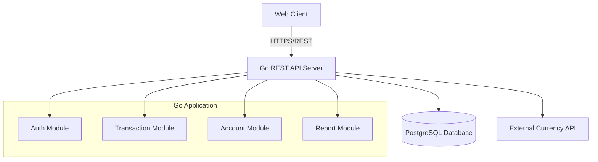

##### Sequence diagram
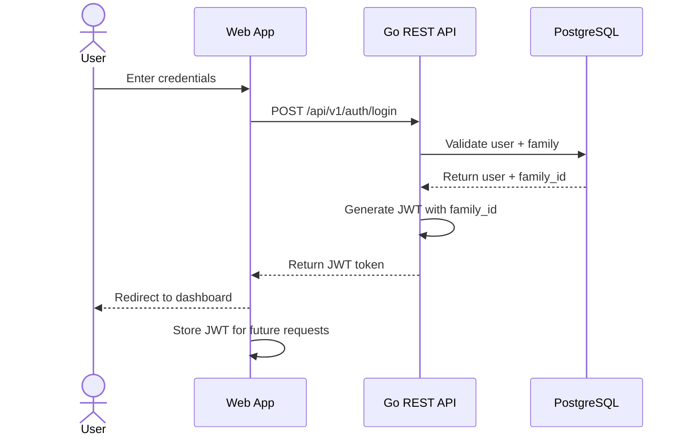

#### 2.1.2 User Authentication
##### Description
Authenticates family members and provides JWT tokens with family context for accessing shared financial data.
<br /><br />

##### Endpoint
```http
POST https://api.expensetracker.digitlock.systems/api/v1/auth/login
```

##### Authorization
:negative_squared_cross_mark: _No authorization required for login endpoint._

##### Request parameters
| Body parameter | Type | Required | Description | Example |
|------------|------|-----------|--------------|----------|
| email | String | Yes | User email address | igor@example.com |
| password | String | Yes | User password (plain text over HTTPS) | securePassword123 |

###### Request example
```http
POST https://api.expensetracker.digitlock.systems/api/v1/auth/login
Content-Type: application/json
Accept: application/json
Authorization: Bearer <token>
```

###### Body

```json
{
  "email": "igor@example.com", 
  "password": "securePassword123"
}
```
<br />

##### Response parameters
| Body parameter | Type | Required | Description | Example |
|------------|------|-----------|--------------|----------|
| success | Boolean | Yes | Request execution status | true |
| data | Object | Yes | Response data container | See nested parameters below |
| data.token | String | Yes | JWT authentication token for API access | eyJhbGciOiJIUzI1NiIsInR5cCI6IkpXVCJ9... |
| data.user | Object | Yes | Authenticated user information | See nested parameters below |
| data.user.id | String | Yes | Unique user identifier | user_123 |
| data.user.email | String | Yes | User email address | igor@example.com |
| data.user.name | String | Yes | User display name | Igor Kudinov |
| data.user.family_id | String | Yes | Family identifier for data scoping | family_456 |
| data.expires_in | Integer | Yes | Token expiration time in seconds | 86400 |

###### Response body example
```json
{
  "success": true,
  "data": {
    "token": "eyJhbGciOiJIUzI1NiIsInR5cCI6IkpXVCJ9...",
    "user": {
      "id": "user_123",
      "email": "igor@example.com",
      "name": "Igor Kudinov",
      "family_id": "family_456"
    },
    "expires_in": 86400
  }
}
```
<br />


#### 2.1.3 Transaction Management
##### Description
Core functionality for creating, reading, updating, and deleting family income and expense transactions.

##### Sequence diagram
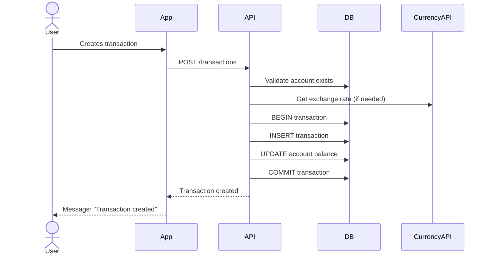

##### Endpoint
```http
POST   https://api.expensetracker.digitlock.systems/api/v1/transactions
POST    https://api.expensetracker.digitlock.systems/api/v1/transactions
PATCH  https://api.expensetracker.digitlock.systems/api/v1/transactions/{id}
DELETE https://api.expensetracker.digitlock.systems/api/v1/transactions/{id}
```

##### Authorization
:closed_lock_with_key: Bearer JWT token required. Family context extracted from token.

##### Request parameters - POST - Create Transaction
| Body parameter | Type | Required | Description | Example |
|------------|------|-----------|--------------|----------|
| type | String | Yes | Transaction type: "income" or "expense" | expense |
| amount | Number | Yes | Transaction amount (positive value) | 2500.00 |
| currency | String | Yes | Currency code (RSD or EUR) | RSD |
| category_id | String | Yes | Reference to transaction category | cat_groceries_123 |
| account_id | String | Yes | Reference to account | acc_cash_456 |
| description | String | No | Transaction description | Weekly groceries at Maxi |
| date | String | Yes | Transaction date (YYYY-MM-DD) | 2025-10-30 |

###### Request example
```http
POST https://api.expensetracker.digitlock.systems/api/v1/transactions
Content-Type: application/json
Accept: application/json
Authorization: Bearer <token>
```

###### Body
```json
{
  "type": "expense",
  "amount": 2500.00,
  "currency": "RSD",
  "category_id": "cat_groceries_123",
  "account_id": "acc_cash_456",
  "description": "Weekly groceries at Maxi",
  "date": "2025-10-30"
}
```
<br />

##### Response parameters
| Body parameter | Type | Required | Description | Example |
|------------|------|-----------|--------------|----------|
| success | Boolean | Yes | Request execution status | true |

###### Response body example
```json
{
  "success": true
}
```
<br />

##### Request parameters - GET - List Transactions
| Query parameter | Type | Required | Description | Example |
|------------|------|-----------|--------------|----------|
| type | String | No | Filter by transaction type: "income" or "expense" | expense |
| month | String | No | Filter by month (YYYY-MM) | expense |
| account_id | String | No | Filter by account | expense |
| include_inactive | Boolean | No | Include inactive records (default: false) | false |

###### Request example
```http
GET https://api.expensetracker.digitlock.systems/api/v1/transactions?type=expense&month=2025-10
Accept: application/json
Authorization: Bearer <token>
```
<br />

##### Response parameters
| Body parameter | Type | Required | Description | Example |
|------------|------|-----------|--------------|----------|
| success | Boolean | Yes | Request execution status | true |
| data | Object | Yes | Response data container | See nested parameters below |
| data.transactions | Array | Yes | List of transaction objects | See nested parameters below |
| data.transactions[].id | String | Yes | Unique transaction identifier | txn_789 |
| data.transactions[].type | String | Yes | Transaction type: "income" or "expense" | expense |
| data.transactions[].amount | Number | Yes | Transaction amount in original currency | 2500.00 |
| data.transactions[].currency | String | Yes | Original transaction currency | RSD |
| data.transactions[].amount_base | Number | Yes | Amount converted to family base currency | 2500.00 |
| data.transactions[].base_currency | String | Yes | Family base currency | RSD |
| data.transactions[].category | Object | Yes | Transaction category information | See nested parameters below |
| data.transactions[].category.id | String | Yes | Category unique identifier | cat_groceries_123 |
| data.transactions[].category.name | String | Yes | Category display name | Groceries |
| data.transactions[].category.type | String | Yes | Category type: "income" or "expense" | expense |
| data.transactions[].account | Object | Yes | Account information | See nested parameters below |
| data.transactions[].account.id | String | Yes | Account unique identifier | acc_cash_456 |
| data.transactions[].account.name | String | Yes | Account display name | Cash RSD |
| data.transactions[].account.type | String | Yes | Account type: "cash", "checking", "savings" | cash |
| data.transactions[].description | String | No | Transaction description | Weekly groceries at Maxi |
| data.transactions[].date | String | Yes | Transaction date (YYYY-MM-DD) | 2025-10-30 |
| data.transactions[].created_at | String | Yes | Record creation timestamp (ISO 8601) | 2025-10-30T14:30:00Z |
| data.transactions[].created_by | String | Yes | User who created the transaction | Igor Kudinov |
| data.pagination | Object | Yes | Pagination information | See nested parameters below |
| data.pagination.page | Integer | Yes | Current page number | 1 |
| data.pagination.per_page | Integer | Yes | Items per page | 50 |
| data.pagination.total | Integer | Yes | Total number of items | 1 |
| data.pagination.total_pages | Integer | Yes | Total number of pages | 1 |

###### Response body example
```json
{
  "success": true,
  "data": {
    "transactions": [
      {
        "id": "txn_789",
        "type": "expense",
        "amount": 2500.00,
        "currency": "RSD",
        "amount_base": 2500.00,
        "base_currency": "RSD",
        "category": {
          "id": "cat_groceries_123",
          "name": "Groceries",
          "type": "expense"
        },
        "account": {
          "id": "acc_cash_456", 
          "name": "Cash RSD",
          "type": "cash"
        },
        "description": "Weekly groceries at Maxi",
        "date": "2025-10-30",
        "created_at": "2025-10-30T14:30:00Z",
        "created_by": "Igor Kudinov"
      }
    ],
    "pagination": {
      "page": 1,
      "per_page": 50,
      "total": 1,
      "total_pages": 1
    }
  }
}
```
<br />

##### Request parameters - PATCH - Update Transaction (Partial)
| Path parameter | Type | Required | Description | Example |
|------------|------|-----------|--------------|----------|
| id | String | Yes | Unique transaction identifier | txn_789 |

<br />

| Body parameter | Type | Required | Description | Example |
|------------|------|-----------|--------------|----------|
| type | String | No | Transaction type: "income" or "expense" | expense |
| amount | Number | No | Transaction amount (positive value) | 2600.00 |
| currency | String | No | Currency code (RSD or EUR) | EUR |
| category_id | String | No | Reference to transaction category | cat_groceries_123 |
| account_id | String | No | Reference to account | acc_cash_456 |
| description | String | No | Transaction description | Weekly groceries (updated) |
| date | String | No | Transaction date (YYYY-MM-DD) | 2025-10-31 |

###### Request example
```http
PATCH https://api.expensetracker.digitlock.systems/api/v1/transactions/txn_789
Content-Type: application/json
Accept: application/json
Authorization: Bearer <token>
```

###### Body (partial update - only changed fields)
```json
{
  "amount": 2600.00,
  "description": "Weekly groceries (with cleaning supplies)"
}
```
<br />

##### Response parameters
| Body parameter | Type | Required | Description | Example |
|------------|------|-----------|--------------|----------|
| success | Boolean | Yes | Request execution status | true |
| data | Object | Yes | Response data container | See nested parameters below |
| data.transaction | Object | Yes | Updated transaction object | See nested parameters below |
| data.transaction.id | String | Yes | Unique transaction identifier | txn_789 |
| data.transaction.type | String | Yes | Transaction type: "income" or "expense" | expense |
| data.transaction.amount | Number | Yes | Transaction amount in original currency | 2600.00 |
| data.transaction.currency | String | Yes | Original transaction currency | RSD |
| data.transaction.amount_base | Number | Yes | Amount converted to family base currency | 2600.00 |
| data.transaction.category | Object | Yes | Transaction category information | See nested parameters below |
| data.transaction.category.id | String | Yes | Category unique identifier | cat_groceries_123 |
| data.transaction.category.name | String | Yes | Category display name | Groceries |
| data.transaction.account | Object | Yes | Account information | See nested parameters below |
| data.transaction.account.id | String | Yes | Account unique identifier | acc_cash_456 |
| data.transaction.account.name | String | Yes | Account display name | Cash RSD |
| data.transaction.description | String | No | Transaction description | Weekly groceries (with cleaning supplies) |
| data.transaction.date | String | Yes | Transaction date (YYYY-MM-DD) | 2025-10-30 |
| data.transaction.updated_at | String | Yes | Last update timestamp (ISO 8601) | 2025-10-30T16:45:00Z |

###### Response body example
```json
{
  "success": true,
  "data": {
    "transaction": {
      "id": "txn_789",
      "type": "expense",
      "amount": 2600.00,
      "currency": "RSD",
      "amount_base": 2600.00,
      "category": {
        "id": "cat_groceries_123",
        "name": "Groceries"
      },
      "account": {
        "id": "acc_cash_456",
        "name": "Cash RSD"
      },
      "description": "Weekly groceries (with cleaning supplies)",
      "date": "2025-10-30",
      "updated_at": "2025-10-30T16:45:00Z"
    }
  }
}
```
<br />

##### Request parameters - DELETE - Delete Transaction
> :information_source: _Performs soft delete by setting is_active=false_

| Path parameter | Type | Required | Description | Example |
|------------|------|-----------|--------------|----------|
| id | String | Yes | Unique transaction identifier | txn_789 |

###### Request example
```http
DELETE https://api.expensetracker.digitlock.systems/api/v1/transactions/txn_789
Accept: application/json
Authorization: Bearer <token>
```
<br />

##### Response parameters
| Body parameter | Type | Required | Description | Example |
|------------|------|-----------|--------------|----------|
| success | Boolean | Yes | Request execution status | true |
| message | String | Yes | Request execution message | Resource deleted successfully |

###### Response body example
```json
{
  "success": true,
  "message": "Resource deleted successfully"
}
```
<br />

#### 2.1.4 Account Management
##### Description
Manages family accounts (cash, bank accounts) and provides current balance information with capabilities to create, update, and retrieve account details.

> :information_source: **MVP Note:** Categories are pre-configured during system setup. Custom category management will be available post-MVP. The system includes standard categories: Income (Salary, Freelance, Other), Expenses (Food, Transport, Utilities, Health, Entertainment, Other).

##### Endpoint
```http
GET    https://api.expensetracker.digitlock.systems/api/v1/accounts
POST   https://api.expensetracker.digitlock.systems/api/v1/accounts
PATCH  https://api.expensetracker.digitlock.systems/api/v1/accounts/{id}
DELETE https://api.expensetracker.digitlock.systems/api/v1/accounts/{id}
GET    https://api.expensetracker.digitlock.systems/api/v1/accounts/{id}/balance
```

##### Authorization
:closed_lock_with_key: Bearer JWT token required. Family context extracted from token.
<br />

##### Request parameters - GET - List Accounts
| Query parameter | Type | Required | Description | Example |
|------------|------|-----------|--------------|----------|
| include_inactive | Boolean | No | Include inactive records (default: false) | false |

###### Request example
```http
GET https://api.expensetracker.digitlock.systems/api/v1/accounts
Accept: application/json
Authorization: Bearer <token>
```
<br />

##### Response parameters
| Body parameter | Type | Required | Description | Example |
|------------|------|-----------|--------------|----------|
| success | Boolean | Yes | Request execution status | true |
| data | Object | Yes | Response data container | See nested parameters below |
| data.accounts | Array | Yes | List of family account objects | See nested parameters below |
| data.accounts[].id | String | Yes | Unique account identifier | acc_cash_456 |
| data.accounts[].name | String | Yes | Account display name | Cash RSD |
| data.accounts[].type | String | Yes | Account type: "cash", "checking", "savings" | cash |
| data.accounts[].currency | String | Yes | Account currency (RSD or EUR) | RSD |
| data.accounts[].current_balance | Number | Yes | Current account balance | 15750.00 |
| data.accounts[].is_active | Boolean | Yes | Account status | true |
| data.accounts[].created_at | String | Yes | Record creation timestamp (ISO 8601) | 2025-10-01T10:00:00Z |
| data.accounts[].updated_at | String | Yes | Last update timestamp (ISO 8601) | 2025-10-30T15:30:00Z |

###### Response body example
```json
{
  "success": true,
  "data": {
    "accounts": [
      {
        "id": "acc_cash_456",
        "name": "Cash RSD", 
        "type": "cash",
        "currency": "RSD",
        "current_balance": 15750.00,
        "is_active": true,
        "created_at": "2025-10-01T10:00:00Z",
        "updated_at": "2025-10-30T15:30:00Z"
      },
      {
        "id": "acc_bank_789",
        "name": "Banca Intesa Checking",
        "type": "checking",
        "currency": "RSD", 
        "current_balance": 125340.50,
        "is_active": true,
        "created_at": "2025-10-01T10:00:00Z",
        "updated_at": "2025-10-30T15:30:00Z"
      }
    ]
  }
}
```
<br />

##### Request parameters - POST - Create Account
| Body parameter | Type | Required | Description | Example |
|------------|------|-----------|--------------|----------|
| name | String | Yes | Account display name | Cash EUR |
| type | String | Yes | Account type: "cash", "checking", "savings" | cash |
| currency | String | Yes | Account currency (RSD or EUR) | EUR |
| initial_balance | Number | No | Starting balance (default: 0.00) | 500.00 |

###### Request example
```http
POST https://api.expensetracker.digitlock.systems/api/v1/accounts
Content-Type: application/json
Accept: application/json
Authorization: Bearer <token>
```

###### Body
```json
{
  "name": "Cash EUR",
  "type": "cash",
  "currency": "EUR",
  "initial_balance": 500.00
}
```
<br />

##### Response parameters
| Body parameter | Type | Required | Description | Example |
|------------|------|-----------|--------------|----------|
| success | Boolean | Yes | Request execution status | true |
| data | Object | Yes | Response data container | See nested parameters below |
| data.account | Object | Yes | Created account object | See nested parameters below |
| data.account.id | String | Yes | Unique account identifier | acc_cash_new_123 |
| data.account.name | String | Yes | Account display name | Cash EUR |
| data.account.type | String | Yes | Account type: "cash", "checking", "savings" | cash |
| data.account.currency | String | Yes | Account currency (RSD or EUR) | EUR |
| data.account.current_balance | Number | Yes | Current account balance | 500.00 |
| data.account.is_active | Boolean | Yes | Account status | true |
| data.account.created_at | String | Yes | Record creation timestamp (ISO 8601) | 2025-10-30T16:00:00Z |
| data.account.updated_at | String | Yes | Last update timestamp (ISO 8601) | 2025-10-30T16:00:00Z |

###### Response body example
```json
{
  "success": true,
  "data": {
    "account": {
      "id": "acc_cash_new_123",
      "name": "Cash EUR",
      "type": "cash",
      "currency": "EUR",
      "current_balance": 500.00,
      "is_active": true,
      "created_at": "2025-10-30T16:00:00Z",
      "updated_at": "2025-10-30T16:00:00Z"
    }
  }
}
```
<br />

##### Request parameters - PATCH - Update Account (Partial)
| Path parameter | Type | Required | Description | Example |
|------------|------|-----------|--------------|----------|
| id | String | Yes | Unique account identifier | acc_cash_456 |

<br />

| Body parameter | Type | Required | Description | Example |
|------------|------|-----------|--------------|----------|
| name | String | No | Updated account name | Cash EUR Updated |
| is_active | Boolean | No | Account status | false |

###### Request example
```http
PATCH https://api.expensetracker.digitlock.systems/api/v1/accounts/acc_cash_456
Content-Type: application/json
Accept: application/json
Authorization: Bearer <token>
```

###### Body (partial update - only changed fields)
```json
{
  "name": "Cash RSD Updated",
  "is_active": true
}
```
<br />

##### Response parameters
| Body parameter | Type | Required | Description | Example |
|------------|------|-----------|--------------|----------|
| success | Boolean | Yes | Request execution status | true |
| data | Object | Yes | Response data container | See nested parameters below |
| data.account | Object | Yes | Updated account object | See nested parameters below |
| data.account.id | String | Yes | Unique account identifier | acc_cash_456 |
| data.account.name | String | Yes | Account display name | Cash RSD Updated |
| data.account.type | String | Yes | Account type: "cash", "checking", "savings" | cash |
| data.account.currency | String | Yes | Account currency (RSD or EUR) | RSD |
| data.account.current_balance | Number | Yes | Current account balance | 15750.00 |
| data.account.is_active | Boolean | Yes | Account status | true |
| data.account.created_at | String | Yes | Record creation timestamp (ISO 8601) | 2025-10-01T10:00:00Z |
| data.account.updated_at | String | Yes | Last update timestamp (ISO 8601) | 2025-10-30T16:05:00Z |

###### Response body example
```json
{
  "success": true,
  "data": {
    "account": {
      "id": "acc_cash_456",
      "name": "Cash RSD Updated",
      "type": "cash",
      "currency": "RSD",
      "current_balance": 15750.00,
      "is_active": true,
      "created_at": "2025-10-01T10:00:00Z",
      "updated_at": "2025-10-30T16:05:00Z"
    }
  }
}
```
<br />

##### Request parameters - DELETE - Delete Account
> :information_source: _Performs soft delete by setting is_active=false_

| Path parameter | Type | Required | Description | Example |
|------------|------|-----------|--------------|----------|
| id | String | Yes | Unique account identifier | acc_cash_456 |

###### Request example
```http
DELETE https://api.expensetracker.digitlock.systems/api/v1/accounts/acc_cash_456
Accept: application/json
Authorization: Bearer <token>
```
<br />

##### Response parameters
| Body parameter | Type | Required | Description | Example |
|------------|------|-----------|--------------|----------|
| success | Boolean | Yes | Request execution status | true |
| message | String | Yes | Request execution message | Resource deleted successfully |

###### Response body example
```json
{
  "success": true,
  "message": "Resource deleted successfully"
}
```
<br />

##### Request parameters - GET - Account Balance
| Path parameter | Type | Required | Description | Example |
|------------|------|-----------|--------------|----------|
| id | String | Yes | Unique account identifier | acc_cash_456 |

###### Request example
```http
GET https://api.expensetracker.digitlock.systems/api/v1/accounts/acc_cash_456/balance
Accept: application/json
Authorization: Bearer <token>
```
<br />

##### Response parameters
| Body parameter | Type | Required | Description | Example |
|------------|------|-----------|--------------|----------|
| success | Boolean | Yes | Request execution status | true |
| data | Object | Yes | Response data container | See nested parameters below |
| data.account_id | String | Yes | Unique account identifier | acc_cash_456 |
| data.account_name | String | Yes | Account display name | Cash RSD |
| data.currency | String | Yes | Account currency (RSD or EUR) | RSD |
| data.current_balance | Number | Yes | Current account balance | 15750.00 |
| data.balance_date | String | Yes | Balance calculation timestamp (ISO 8601) | 2025-10-30T16:10:00Z |
| data.last_transaction_date | String | Yes | Last transaction timestamp (ISO 8601) | 2025-10-30T14:30:00Z |

###### Response body example
```json
{
  "success": true,
  "data": {
    "account_id": "acc_cash_456",
    "account_name": "Cash RSD",
    "currency": "RSD",
    "current_balance": 15750.00,
    "balance_date": "2025-10-30T16:10:00Z",
    "last_transaction_date": "2025-10-30T14:30:00Z"
  }
}
```
<br />


#### 2.1.5 Category Management
##### Description
Manages income and expense categories for transaction classification with capabilities to create, update, and organize categories hierarchically.

##### Endpoint
```http
GET    https://api.expensetracker.digitlock.systems/api/v1/categories
POST   https://api.expensetracker.digitlock.systems/api/v1/categories  
PATCH  https://api.expensetracker.digitlock.systems/api/v1/categories/{id}
DELETE https://api.expensetracker.digitlock.systems/api/v1/categories/{id}
```

##### Authorization
:closed_lock_with_key: Bearer JWT token required. Family context extracted from token.
<br />

##### Request parameters - GET - List Categories
| Query parameter | Type | Required | Description | Example |
|------------|------|-----------|--------------|----------|
| type | String | No | Filter by category type: "income" or "expense" | expense |
| parent_id | String | No | Filter by parent category | cat_food_parent |
| is_active | Boolean | No | Filter by status | true |
| include_inactive | Boolean | No | Include inactive records (default: false) | false |

###### Request example
```http
GET https://api.expensetracker.digitlock.systems/api/v1/categories?type=expense&is_active=true
Accept: application/json
Authorization: Bearer <token>
```
<br />

##### Response parameters
| Body parameter | Type | Required | Description | Example |
|------------|------|-----------|--------------|----------|
| success | Boolean | Yes | Request execution status | true |
| data | Object | Yes | Response data container | See nested parameters below |
| data.categories | Array | Yes | List of category objects | See nested parameters below |
| data.categories[].id | String | Yes | Unique category identifier | cat_groceries_123 |
| data.categories[].name | String | Yes | Category display name | Groceries |
| data.categories[].type | String | Yes | Category type: "income" or "expense" | expense |
| data.categories[].parent_id | String | No | Parent category ID for hierarchy (null if root) | cat_food_parent |
| data.categories[].is_active | Boolean | Yes | Category status | true |
| data.categories[].created_at | String | Yes | Record creation timestamp (ISO 8601) | 2025-10-01T10:00:00Z |
| data.categories[].updated_at | String | Yes | Last update timestamp (ISO 8601) | 2025-10-15T14:00:00Z |

###### Response body example
```json
{
  "success": true,
  "data": {
    "categories": [
      {
        "id": "cat_groceries_123",
        "name": "Groceries",
        "type": "expense",
        "parent_id": "cat_food_parent",
        "is_active": true,
        "created_at": "2025-10-01T10:00:00Z",
        "updated_at": "2025-10-15T14:00:00Z"
      },
      {
        "id": "cat_salary_456", 
        "name": "Salary",
        "type": "income",
        "parent_id": null,
        "is_active": true,
        "created_at": "2025-10-01T10:00:00Z",
        "updated_at": "2025-10-01T10:00:00Z"
      }
    ]
  }
}
```
<br />

##### Request parameters - POST - Create Category
| Body parameter | Type | Required | Description | Example |
|------------|------|-----------|--------------|----------|
| name | String | Yes | Category display name | Transportation |
| type | String | Yes | Category type: "income" or "expense" | expense |
| parent_id | String | No | Parent category ID for hierarchy | cat_parent_123 |

###### Request example
```http
POST https://api.expensetracker.digitlock.systems/api/v1/categories
Content-Type: application/json
Accept: application/json
Authorization: Bearer <token>
```

###### Body
```json
{
  "name": "Transportation",
  "type": "expense",
  "parent_id": null
}
```
<br />

##### Response parameters
| Body parameter | Type | Required | Description | Example |
|------------|------|-----------|--------------|----------|
| success | Boolean | Yes | Request execution status | true |
| data | Object | Yes | Response data container | See nested parameters below |
| data.category | Object | Yes | Created category object | See nested parameters below |
| data.category.id | String | Yes | Unique category identifier | cat_transport_789 |
| data.category.name | String | Yes | Category display name | Transportation |
| data.category.type | String | Yes | Category type: "income" or "expense" | expense |
| data.category.parent_id | String | No | Parent category ID for hierarchy (null if root) | null |
| data.category.is_active | Boolean | Yes | Category status | true |
| data.category.created_at | String | Yes | Record creation timestamp (ISO 8601) | 2025-10-30T16:20:00Z |
| data.category.updated_at | String | Yes | Last update timestamp (ISO 8601) | 2025-10-30T16:20:00Z |

###### Response body example
```json
{
  "success": true,
  "data": {
    "category": {
      "id": "cat_transport_789",
      "name": "Transportation",
      "type": "expense",
      "parent_id": null,
      "is_active": true,
      "created_at": "2025-10-30T16:20:00Z",
      "updated_at": "2025-10-30T16:20:00Z"
    }
  }
}
```
<br />

##### Request parameters - PATCH - Update Category (Partial)
| Path parameter | Type | Required | Description | Example |
|------------|------|-----------|--------------|----------|
| id | String | Yes | Unique category identifier | cat_transport_789 |

<br />

| Body parameter | Type | Required | Description | Example |
|------------|------|-----------|--------------|----------|
| name | String | No | Updated category name | Transportation Updated |
| parent_id | String | No | New parent category | cat_parent_456 |
| is_active | Boolean | No | Category status | false |

###### Request example
```http
PATCH https://api.expensetracker.digitlock.systems/api/v1/categories/cat_transport_789
Content-Type: application/json
Accept: application/json
Authorization: Bearer <token>
```

###### Body (partial update - only changed fields)
```json
{
  "name": "Transportation & Travel",
  "is_active": true
}
```
<br />

##### Response parameters
| Body parameter | Type | Required | Description | Example |
|------------|------|-----------|--------------|----------|
| success | Boolean | Yes | Request execution status | true |
| data | Object | Yes | Response data container | See nested parameters below |
| data.category | Object | Yes | Updated category object | See nested parameters below |
| data.category.id | String | Yes | Unique category identifier | cat_transport_789 |
| data.category.name | String | Yes | Category display name | Transportation & Travel |
| data.category.type | String | Yes | Category type: "income" or "expense" | expense |
| data.category.parent_id | String | No | Parent category ID for hierarchy (null if root) | null |
| data.category.is_active | Boolean | Yes | Category status | true |
| data.category.created_at | String | Yes | Record creation timestamp (ISO 8601) | 2025-10-30T16:20:00Z |
| data.category.updated_at | String | Yes | Last update timestamp (ISO 8601) | 2025-10-30T16:25:00Z |

###### Response body example
```json
{
  "success": true,
  "data": {
    "category": {
      "id": "cat_transport_789",
      "name": "Transportation & Travel",
      "type": "expense",
      "parent_id": null,
      "is_active": true,
      "created_at": "2025-10-30T16:20:00Z",
      "updated_at": "2025-10-30T16:25:00Z"
    }
  }
}
```
<br />

##### Request parameters - DELETE - Delete category
> :information_source: _Performs soft delete by setting is_active=false_

| Path parameter | Type | Required | Description | Example |
|------------|------|-----------|--------------|----------|
| id | String | Yes | Unique category identifier | cat_transport_789 |

###### Request example
```http
DELETE https://api.expensetracker.digitlock.systems/api/v1/categories/cat_transport_789
Accept: application/json
Authorization: Bearer <token>
```
<br />

##### Response parameters
| Body parameter | Type | Required | Description | Example |
|------------|------|-----------|--------------|----------|
| success | Boolean | Yes | Request execution status | true |
| message | String | Yes | Request execution message | Resource deleted successfully |

###### Response body example
```json
{
  "success": true,
  "message": "Resource deleted successfully"
}
```
<br />


#### 2.1.6 Basic Reporting
##### Description
Provides basic financial reports for family budget analysis including spending patterns and monthly summaries.

##### Endpoint
```http
GET https://api.expensetracker.digitlock.systems/api/v1/reports/spending-by-category
GET https://api.expensetracker.digitlock.systems/api/v1/reports/monthly-summary
```

##### Authorization
:closed_lock_with_key: Bearer JWT token required. Family context extracted from token.
<br />

##### Request parameters - GET - Spending by Category Report
| Query parameter | Type | Required | Description | Example |
|------------|------|-----------|--------------|----------|
| start_date | String | No | Report start date (YYYY-MM-DD), default: current month start | 2025-10-01 |
| end_date | String | No | Report end date (YYYY-MM-DD), default: current date | 2025-10-31 |
| currency | String | No | Currency for amounts (RSD or EUR), default: family base currency | RSD |
| type | String | No | Transaction type filter: "income", "expense", default: "expense" | expense |

###### Request example
```http
GET https://api.expensetracker.digitlock.systems/api/v1/reports/spending-by-category?start_date=2025-10-01&end_date=2025-10-31&currency=RSD&type=expense
Accept: application/json
Authorization: Bearer <token>
```
<br />

##### Response parameters
| Body parameter | Type | Required | Description | Example |
|------------|------|-----------|--------------|----------|
| success | Boolean | Yes | Request execution status | true |
| data | Object | Yes | Response data container | See nested parameters below |
| data.report_type | String | Yes | Type of report generated | spending_by_category |
| data.period | Object | Yes | Report period information | See nested parameters below |
| data.period.start_date | String | Yes | Report start date (YYYY-MM-DD) | 2025-10-01 |
| data.period.end_date | String | Yes | Report end date (YYYY-MM-DD) | 2025-10-31 |
| data.currency | String | Yes | Currency used for amounts | RSD |
| data.transaction_type | String | Yes | Transaction type filter applied | expense |
| data.spending_by_category | Array | Yes | List of category spending objects | See nested parameters below |
| data.spending_by_category[].category_id | String | Yes | Category unique identifier | cat_groceries_123 |
| data.spending_by_category[].category_name | String | Yes | Category display name | Groceries |
| data.spending_by_category[].total_amount | Number | Yes | Total spending amount for category | 18500.00 |
| data.spending_by_category[].transaction_count | Integer | Yes | Number of transactions in category | 8 |
| data.spending_by_category[].percentage | Number | Yes | Percentage of total spending | 35.2 |
| data.spending_by_category[].average_per_transaction | Number | Yes | Average amount per transaction | 2312.50 |
| data.total_amount | Number | Yes | Total amount across all categories | 52500.00 |
| data.total_transactions | Integer | Yes | Total number of transactions | 35 |
| data.generated_at | String | Yes | Report generation timestamp (ISO 8601) | 2025-10-30T16:30:00Z |

###### Response body example
```json
{
  "success": true,
  "data": {
    "report_type": "spending_by_category",
    "period": {
      "start_date": "2025-10-01",
      "end_date": "2025-10-31"
    },
    "currency": "RSD",
    "transaction_type": "expense",
    "spending_by_category": [
      {
        "category_id": "cat_groceries_123",
        "category_name": "Groceries",
        "total_amount": 18500.00,
        "transaction_count": 8,
        "percentage": 35.2,
        "average_per_transaction": 2312.50
      },
      {
        "category_id": "cat_transport_789",
        "category_name": "Transportation", 
        "total_amount": 12300.00,
        "transaction_count": 15,
        "percentage": 23.4,
        "average_per_transaction": 820.00
      }
    ],
    "total_amount": 52500.00,
    "total_transactions": 35,
    "generated_at": "2025-10-30T16:30:00Z"
  }
}
```
<br />

##### Request parameters - GET - Monthly Summary Report
| Query parameter | Type | Required | Description | Example |
|------------|------|-----------|--------------|----------|
| month | String | No | Report month (YYYY-MM), default: current month | 2025-10 |
| currency | String | No | Currency for amounts (RSD or EUR), default: family base currency | RSD |

###### Request example
```http
GET https://api.expensetracker.digitlock.systems/api/v1/reports/monthly-summary?month=2025-10&currency=RSD
Accept: application/json
Authorization: Bearer <token>
```
<br />

##### Response parameters
| Body parameter | Type | Required | Description | Example |
|------------|------|-----------|--------------|----------|
| success | Boolean | Yes | Request execution status | true |
| data | Object | Yes | Response data container | See nested parameters below |
| data.report_type | String | Yes | Type of report generated | monthly_summary |
| data.month | String | Yes | Report month (YYYY-MM) | 2025-10 |
| data.currency | String | Yes | Currency used for amounts | RSD |
| data.summary | Object | Yes | Financial summary for the month | See nested parameters below |
| data.summary.total_income | Number | Yes | Total income for the month | 125000.00 |
| data.summary.total_expenses | Number | Yes | Total expenses for the month | 87500.00 |
| data.summary.net_savings | Number | Yes | Net savings (income - expenses) | 37500.00 |
| data.summary.savings_rate | Number | Yes | Savings rate percentage | 30.0 |
| data.income_breakdown | Object | Yes | Income by category | See nested parameters below |
| data.expense_breakdown | Object | Yes | Expenses by category | See nested parameters below |
| data.account_balances | Object | Yes | Current account balances | See nested parameters below |
| data.account_balances.total | Number | Yes | Total balance across all accounts | 141090.50 |
| data.transaction_counts | Object | Yes | Transaction count statistics | See nested parameters below |
| data.transaction_counts.income_transactions | Integer | Yes | Number of income transactions | 4 |
| data.transaction_counts.expense_transactions | Integer | Yes | Number of expense transactions | 45 |
| data.transaction_counts.total_transactions | Integer | Yes | Total number of transactions | 49 |
| data.generated_at | String | Yes | Report generation timestamp (ISO 8601) | 2025-10-30T16:35:00Z |

###### Response body example
```json
{
  "success": true,
  "data": {
    "report_type": "monthly_summary",
    "month": "2025-10",
    "currency": "RSD",
    "summary": {
      "total_income": 125000.00,
      "total_expenses": 87500.00,
      "net_savings": 37500.00,
      "savings_rate": 30.0
    },
    "income_breakdown": {
      "salary": 120000.00,
      "freelance": 5000.00
    },
    "expense_breakdown": {
      "groceries": 25000.00,
      "transportation": 15000.00,
      "utilities": 12000.00,
      "entertainment": 8500.00,
      "other": 27000.00
    },
    "account_balances": {
      "cash_rsd": 15750.00,
      "bank_checking": 125340.50,
      "total": 141090.50
    },
    "transaction_counts": {
      "income_transactions": 4,
      "expense_transactions": 45,
      "total_transactions": 49
    },
    "generated_at": "2025-10-30T16:35:00Z"
  }
}
```
<br />


#### 2.1.7 Currency Management
##### Description
Manages multi-currency support for family finances including exchange rate retrieval and currency conversion capabilities.

##### Endpoint
```http
GET https://api.expensetracker.digitlock.systems/api/v1/currencies/rates
GET https://api.expensetracker.digitlock.systems/api/v1/currencies/convert
```

##### Authorization
:closed_lock_with_key: Bearer JWT token required.
<br />

##### Request parameters - GET - Exchange Rates
- _No request parameters required._

###### Request example
```http
GET https://api.expensetracker.digitlock.systems/api/v1/currencies/rates
Accept: application/json
Authorization: Bearer <token>
```
<br />

##### Response parameters
| Body parameter | Type | Required | Description | Example |
|------------|------|-----------|--------------|----------|
| success | Boolean | Yes | Request execution status | true |
| data | Object | Yes | Response data container | See nested parameters below |
| data.base_currency | String | Yes | Base currency for exchange rates | RSD |
| data.rates | Object | Yes | Exchange rates object with currency codes as keys | See nested parameters below |
| data.rates.EUR | Number | Yes | Exchange rate from base currency to EUR | 0.0085 |
| data.rates.RSD | Number | Yes | Exchange rate from base currency to RSD (always 1.0) | 1.0000 |
| data.last_updated | String | Yes | Last update timestamp for exchange rates (ISO 8601) | 2025-10-30T12:00:00Z |
| data.source | String | Yes | Source of exchange rate data | external_api |

###### Response body example
```json
{
  "success": true,
  "data": {
    "base_currency": "RSD",
    "rates": {
      "EUR": 0.0085,
      "RSD": 1.0000
    },
    "last_updated": "2025-10-30T12:00:00Z",
    "source": "external_api"
  }
}
```
<br />

##### Request parameters - GET - Currency Conversion
| Query parameter | Type | Required | Description | Example |
|------------|------|-----------|--------------|----------|
| amount | Number | Yes | Amount to convert | 1000.00 |
| from | String | Yes | Source currency (RSD or EUR) | RSD |
| to | String | Yes | Target currency (RSD or EUR) | EUR |

###### Request example
```http
GET https://api.expensetracker.digitlock.systems/api/v1/currencies/convert?amount=1000.00&from=RSD&to=EUR
Accept: application/json
Authorization: Bearer <token>
```
<br />

##### Response parameters
| Body parameter | Type | Required | Description | Example |
|------------|------|-----------|--------------|----------|
| success | Boolean | Yes | Request execution status | true |
| data | Object | Yes | Response data container | See nested parameters below |
| data.original_amount | Number | Yes | Original amount to convert | 1000.00 |
| data.original_currency | String | Yes | Source currency code | RSD |
| data.converted_amount | Number | Yes | Converted amount in target currency | 8.50 |
| data.target_currency | String | Yes | Target currency code | EUR |
| data.exchange_rate | Number | Yes | Exchange rate used for conversion | 0.0085 |
| data.conversion_date | String | Yes | Conversion timestamp (ISO 8601) | 2025-10-30T16:45:00Z |

###### Response body example
```json
{
  "success": true,
  "data": {
    "original_amount": 1000.00,
    "original_currency": "RSD",
    "converted_amount": 8.50,
    "target_currency": "EUR",
    "exchange_rate": 0.0085,
    "conversion_date": "2025-10-30T16:45:00Z"
  }
}
```
<br />


#### 2.1.8 User Management
##### Description
Manages user registration, profile updates, and family setup for the expense tracking system.

##### Sequence diagram
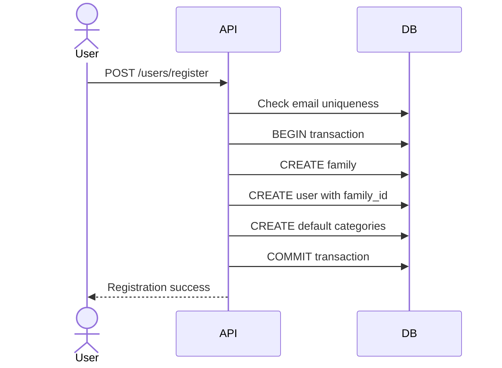

##### Endpoint
```http
POST https://api.expensetracker.digitlock.systems/api/v1/users/register
GET  https://api.expensetracker.digitlock.systems/api/v1/users/profile
PATCH https://api.expensetracker.digitlock.systems/api/v1/users/profile
```

##### Authorization
:closed_lock_with_key: Bearer JWT token required only for _User Profile_ and _Update Profile_ methods.
<br />

##### Request parameters - POST - Register User
| Body parameter | Type | Required | Description | Example |
|------------|------|-----------|--------------|----------|
| email | String | Yes | User email address | igor@example.com |
| password | String | Yes | User password (min 8 characters) | securePassword123 |
| name | String | Yes | User display name | Igor Kudinov |
| family_name | String | Yes | Family name for new family creation | Kudinov Family |
| base_currency | String | Yes | Family base currency (RSD or EUR) | RSD |

###### Request example
```http
POST https://api.expensetracker.digitlock.systems/api/v1/users/register
Content-Type: application/json
Accept: application/json
```

###### Body
```json
{
  "email": "igor@example.com",
  "password": "securePassword123",
  "name": "Igor Kudinov",
  "family_name": "Kudinov Family",
  "base_currency": "RSD"
}
```
<br />

##### Response parameters
| Body parameter | Type | Required | Description | Example |
|------------|------|-----------|--------------|----------|
| success | Boolean | Yes | Request execution status | true |
| data | Object | Yes | Response data container | See nested parameters below |
| data.user | Object | Yes | Created user object | See nested parameters below |
| data.user.id | String | Yes | Unique user identifier | user_123 |
| data.user.email | String | Yes | User email address | igor@example.com |
| data.user.name | String | Yes | User display name | Igor Kudinov |
| data.user.family_id | String | Yes | Family identifier | family_456 |
| data.user.family_name | String | Yes | Family display name | Kudinov Family |
| data.user.is_active | Boolean | Yes | User account status | true |
| data.user.created_at | String | Yes | Record creation timestamp (ISO 8601) | 2025-10-30T17:00:00Z |
| data.message | String | Yes | Registration confirmation message | User registered successfully. Please login to continue. |

###### Response body example
```json
{
  "success": true,
  "data": {
    "user": {
      "id": "user_123",
      "email": "igor@example.com",
      "name": "Igor Kudinov",
      "family_id": "family_456",
      "family_name": "Kudinov Family",
      "is_active": true,
      "created_at": "2025-10-30T17:00:00Z"
    },
    "message": "User registered successfully. Please login to continue."
  }
}
```
<br />

##### Request parameters - GET - User Profile
- _No request parameters required._

###### Request example
```http
GET https://api.expensetracker.digitlock.systems/api/v1/users/profile
Accept: application/json
Authorization: Bearer <token>
```
<br />

##### Response parameters
| Body parameter | Type | Required | Description | Example |
|------------|------|-----------|--------------|----------|
| success | Boolean | Yes | Request execution status | true |
| data | Object | Yes | Response data container | See nested parameters below |
| data.user | Object | Yes | User profile object | See nested parameters below |
| data.user.id | String | Yes | Unique user identifier | user_123 |
| data.user.email | String | Yes | User email address | igor@example.com |
| data.user.name | String | Yes | User display name | Igor Kudinov |
| data.user.family | Object | Yes | Family information | See nested parameters below |
| data.user.family.id | String | Yes | Family unique identifier | family_456 |
| data.user.family.name | String | Yes | Family display name | Kudinov Family |
| data.user.family.base_currency | String | Yes | Family base currency | RSD |
| data.user.family.member_count | Integer | Yes | Number of family members | 2 |
| data.user.is_active | Boolean | Yes | User account status | true |
| data.user.created_at | String | Yes | Record creation timestamp (ISO 8601) | 2025-10-30T17:00:00Z |
| data.user.last_login | String | Yes | Last login timestamp (ISO 8601) | 2025-10-30T17:30:00Z |

###### Response body example
```json
{
  "success": true,
  "data": {
    "user": {
      "id": "user_123",
      "email": "igor@example.com",
      "name": "Igor Kudinov",
      "family": {
        "id": "family_456",
        "name": "Kudinov Family",
        "base_currency": "RSD",
        "member_count": 2
      },
      "is_active": true,
      "created_at": "2025-10-30T17:00:00Z",
      "last_login": "2025-10-30T17:30:00Z"
    }
  }
}
```
<br />

##### Request parameters - PATCH - Update Profile (Partial)
| Body parameter | Type | Required | Description | Example |
|------------|------|-----------|--------------|----------|
| name | String | No | Updated user display name | Igor K. Updated |
| password | String | No | New password (min 8 characters) | newPassword456 |

###### Request example
```http
PATCH https://api.expensetracker.digitlock.systems/api/v1/users/profile
Content-Type: application/json
Accept: application/json
Authorization: Bearer <token>
```

###### Body (partial update - only changed fields)
```json
{
  "name": "Igor K. Updated"
}
```
<br />

##### Response parameters
| Body parameter | Type | Required | Description | Example |
|------------|------|-----------|--------------|----------|
| success | Boolean | Yes | Request execution status | true |
| data | Object | Yes | Response data container | See nested parameters below |
| data.user | Object | Yes | Updated user object | See nested parameters below |
| data.user.id | String | Yes | Unique user identifier | user_123 |
| data.user.email | String | Yes | User email address | igor@example.com |
| data.user.name | String | Yes | Updated user display name | Igor K. Updated |
| data.user.family_id | String | Yes | Family identifier | family_456 |
| data.user.updated_at | String | Yes | Last update timestamp (ISO 8601) | 2025-10-30T17:35:00Z |
| data.message | String | Yes | Update confirmation message | Profile updated successfully |

###### Response body example
```json
{
  "success": true,
  "data": {
    "user": {
      "id": "user_123",
      "email": "igor@example.com",
      "name": "Igor K. Updated",
      "family_id": "family_456",
      "updated_at": "2025-10-30T17:35:00Z"
    },
    "message": "Profile updated successfully"
  }
}
```
<br />

---
<br />


### 2.2 User Interface

#### 2.2.1 Dashboard (Main Screen)

##### Use case scenario
User opens the application and immediately sees their current financial status: account balances, recent transactions, and quick action buttons for adding new income/expenses.
<br /><br />

##### Actions occurring during form opening
- GET /api/v1/accounts (load current balances)
- GET /api/v1/transactions?limit=10 (load recent transactions)
- GET /api/v1/reports/monthly-summary (load current month overview)

##### Designs
Link to Figma: [Dashboard Wireframe](#) *(to be created)*

###### Basic layout:
- Top section: Family total balance + currency selector (RSD/EUR)
- Middle section: Quick action buttons (Add Income, Add Expense)
- Bottom section: Recent transactions list (last 10)
<br />

##### Roles and permissions
| № | Name of the role | For what it needs access | What permissions it has |
|----|------------------|--------------------------|--------------------------|
| 1 | Family Member | View and manage family finances | Read/write all family transactions, accounts, categories |

##### Location
Default landing page after login.
<br /><br />

##### Modes and configuration
Single view mode. Currency display can be toggled between RSD and EUR.
<br /><br />

##### Elements
| Name | Type | Is editable | Is visible | Source | Description | Validation |
|------|------|-------------|------------|--------|-------------|------------|
| Total Balance | Display | No | Yes | GET /accounts | Sum of all account balances | Currency formatting |
| Currency Toggle | Button | Yes | Yes | Local state | Switch between RSD/EUR view | - |
| Add Income Button | Button | Yes | Yes | Navigation | Opens Add Income form | - |
| Add Expense Button | Button | Yes | Yes | Navigation | Opens Add Expense form | - |
| Recent Transactions | List | No | Yes | GET /transactions | Last 10 transactions | Pagination |
<br />


#### 2.2.2 Add Transaction Form

##### Use case scenario
User needs to quickly record an income or expense. Form should be simple and optimized for mobile input with commonly used categories and accounts readily available.
<br /><br />

##### Actions occurring during form opening
- GET /api/v1/categories (load available categories filtered by transaction type)
- GET /api/v1/accounts (load available accounts)

##### Designs
Link to Figma: [Add Transaction Form](#) *(to be created)*

###### Form layout with:
- Transaction type toggle (Income/Expense)
- Amount input (large, numeric keyboard)
- Currency selector (RSD/EUR)
- Category dropdown (filtered by type)
- Account selector
- Date picker (defaults to today)
- Optional description field
<br />

##### Roles and permissions
| № | Name of the role | For what it needs access | What permissions it has |
|----|------------------|--------------------------|--------------------------|
| 1 | Family Member | Add new financial transactions | Create transactions for family |

##### Location
Accessible from Dashboard via "Add Income" or "Add Expense" buttons, or main navigation menu.
<br /><br />

##### Modes and configuration
- **Income Mode**: Shows income categories, positive amount handling
- **Expense Mode**: Shows expense categories, positive amount handling (automatically treated as expense)
<br /><br />

##### Elements
| Name | Type | Is editable | Is visible | Source | Description | Validation |
|------|------|-------------|------------|--------|-------------|------------|
| Transaction Type | Toggle | Yes | Yes | Local state | Income/Expense selector | Required |
| Amount | Number Input | Yes | Yes | User input | Transaction amount | Required, >0, max 2 decimal places |
| Currency | Select | Yes | Yes | Static (RSD/EUR) | Currency selector | Required |
| Category | Select | Yes | Yes | GET /categories | Transaction category | Required |
| Account | Select | Yes | Yes | GET /accounts | Source/target account | Required |
| Date | Date Picker | Yes | Yes | User input | Transaction date | Required, not future |
| Description | Text Input | Yes | Yes | User input | Optional description | Max 255 chars |
| Save Button | Button | Yes | Yes | Form action | Submit transaction | Form validation |
<br />


#### 2.2.3 Login Screen

##### Use case scenario
User enters email and password to authenticate and access family financial data. System validates credentials and redirects to dashboard upon successful login.
<br /><br />

##### Actions occurring during form opening
- No API calls required on form load

##### Designs
Link to Figma: [Login Screen](#) *(to be created)*

###### Simple centered form with:
- Application logo/title
- Email input field
- Password input field
- Login button
- "Register" link for new users
<br />

##### Roles and permissions
| № | Name of the role | For what it needs access | What permissions it has |
|----|------------------|--------------------------|--------------------------|
| 1 | Anonymous User | System authentication | Access to login functionality |

##### Location
Entry point of the application, accessible when not authenticated.
<br /><br />

##### Modes and configuration
Single mode. Form validation on client and server side.
<br /><br />

##### Elements
| Name | Type | Is editable | Is visible | Source | Description | Validation |
|------|------|-------------|------------|--------|-------------|------------|
| Email | Text Input | Yes | Yes | User input | User email address | Required, email format |
| Password | Password Input | Yes | Yes | User input | User password | Required, min 8 characters |
| Login Button | Button | Yes | Yes | Form action | Submit credentials | Form validation |
| Register Link | Link | Yes | Yes | Navigation | Navigate to registration | - |
| Error Message | Display | No | Conditional | API response | Authentication error display | - |
<br />


#### 2.2.4 Registration Screen

##### Use case scenario
New user creates account and family setup. User provides personal information, creates family, and sets base currency for financial tracking.
<br />

##### Actions occurring during form opening
- No API calls required on form load

##### Designs
Link to Figma: [Registration Screen](#) *(to be created)*

###### Multi-step form with:
- User information (email, password, name)
- Family setup (family name, base currency)
- Terms and conditions acceptance
- Submit button
<br />

##### Roles and permissions
| № | Name of the role | For what it needs access | What permissions it has |
|----|------------------|--------------------------|--------------------------|
| 1 | Anonymous User | Account creation | Access to registration functionality |

##### Location
Accessible from Login screen via "Register" link.
<br /><br />

##### Modes and configuration
Single mode with step-by-step validation.
<br /><br />

##### Elements
| Name | Type | Is editable | Is visible | Source | Description | Validation |
|------|------|-------------|------------|--------|-------------|------------|
| Email | Text Input | Yes | Yes | User input | User email address | Required, email format, unique |
| Password | Password Input | Yes | Yes | User input | User password | Required, min 8 characters |
| Confirm Password | Password Input | Yes | Yes | User input | Password confirmation | Required, match password |
| Name | Text Input | Yes | Yes | User input | User display name | Required, max 100 chars |
| Family Name | Text Input | Yes | Yes | User input | Family display name | Required, max 100 chars |
| Base Currency | Select | Yes | Yes | Static (RSD/EUR) | Family base currency | Required |
| Register Button | Button | Yes | Yes | Form action | Submit registration | Form validation |
| Login Link | Link | Yes | Yes | Navigation | Navigate to login | - |
<br />


#### 2.2.5 Transactions List Screen

##### Use case scenario
User views complete list of family transactions with filtering and search capabilities. Allows quick overview of financial activity and navigation to individual transaction details.
<br />

##### Actions occurring during form opening
- GET /api/v1/transactions (load transactions with pagination)
- GET /api/v1/categories (load categories for filtering)
- GET /api/v1/accounts (load accounts for filtering)

##### Designs
Link to Figma: [Transactions List](#) *(to be created)*

###### Layout with:
- Filter bar (type, category, account, date range)
- Transaction list with key information
- Pagination controls
- Add transaction floating button
<br />

##### Roles and permissions
| № | Name of the role | For what it needs access | What permissions it has |
|----|------------------|--------------------------|--------------------------|
| 1 | Family Member | View family transactions | Read all family transactions |

##### Location
Accessible from main navigation menu or "View All" link from Dashboard.
<br /><br />

##### Modes and configuration
Single view with filtering options. Supports pagination for large datasets.
<br /><br />

##### Elements
| Name | Type | Is editable | Is visible | Source | Description | Validation |
|------|------|-------------|------------|--------|-------------|------------|
| Type Filter | Select | Yes | Yes | Static (All/Income/Expense) | Filter by transaction type | - |
| Category Filter | Select | Yes | Yes | GET /categories | Filter by category | - |
| Account Filter | Select | Yes | Yes | GET /accounts | Filter by account | - |
| Date Range Filter | Date Range | Yes | Yes | User input | Filter by date range | Valid date range |
| Transaction List | List | No | Yes | GET /transactions | Paginated transaction list | - |
| Pagination | Controls | Yes | Yes | API pagination | Navigate through pages | - |
| Add Transaction Button | Button | Yes | Yes | Navigation | Open add transaction form | - |
<br />


#### 2.2.6 Transaction Details/Edit Screen

##### Use case scenario
User views detailed information about a specific transaction and can edit or delete it. Form is pre-populated with existing transaction data.
<br />

##### Actions occurring during form opening
- GET /api/v1/transactions/{id} (load transaction details)
- GET /api/v1/categories (load available categories)
- GET /api/v1/accounts (load available accounts)

##### Designs
Link to Figma: [Transaction Edit](#) *(to be created)*

###### Form layout similar to Add Transaction with:
- Pre-populated fields with existing data
- Edit/Save mode toggle
- Delete button with confirmation
- Cancel button to return to list
<br />

##### Roles and permissions
| № | Name of the role | For what it needs access | What permissions it has |
|----|------------------|--------------------------|--------------------------|
| 1 | Family Member | Edit family transactions | Update/delete family transactions |

##### Location
Accessible by clicking on transaction from Transactions List or Dashboard recent transactions.
<br /><br />

##### Modes and configuration
- **View Mode**: Display-only transaction details
- **Edit Mode**: Editable form fields for transaction modification
<br /><br />

##### Elements
| Name | Type | Is editable | Is visible | Source | Description | Validation |
|------|------|-------------|------------|--------|-------------|------------|
| Transaction Type | Display/Toggle | Edit mode only | Yes | Transaction data | Income/Expense type | Required in edit mode |
| Amount | Display/Number Input | Edit mode only | Yes | Transaction data | Transaction amount | Required, >0, max 2 decimal places |
| Currency | Display/Select | Edit mode only | Yes | Transaction data | Currency selector | Required in edit mode |
| Category | Display/Select | Edit mode only | Yes | Transaction data | Transaction category | Required in edit mode |
| Account | Display/Select | Edit mode only | Yes | Transaction data | Source/target account | Required in edit mode |
| Date | Display/Date Picker | Edit mode only | Yes | Transaction data | Transaction date | Required, not future |
| Description | Display/Text Input | Edit mode only | Yes | Transaction data | Transaction description | Max 255 chars |
| Edit Button | Button | Yes | View mode | Local state | Switch to edit mode | - |
| Save Button | Button | Yes | Edit mode | Form action | Save transaction changes | Form validation |
| Cancel Button | Button | Yes | Edit mode | Local state | Cancel edit, return to view | - |
| Delete Button | Button | Yes | Yes | Form action | Delete transaction | Confirmation dialog |
<br />


#### 2.2.7 Accounts Management Screen

##### Use case scenario
User manages family accounts (cash, bank accounts) including creating new accounts, editing existing ones, and viewing current balances.
<br />

##### Actions occurring during form opening
- GET /api/v1/accounts (load all family accounts)

##### Designs
Link to Figma: [Accounts Management](#) *(to be created)*

###### Layout with:
- Accounts list with balance information
- Add new account button
- Edit/delete actions for each account
- Total balance summary
<br />

##### Roles and permissions
| № | Name of the role | For what it needs access | What permissions it has |
|----|------------------|--------------------------|--------------------------|
| 1 | Family Member | Manage family accounts | Create/read/update family accounts |

##### Location
Accessible from main navigation menu or settings.
<br /><br />

##### Modes and configuration
Single view with inline editing capabilities for account names and status.
<br /><br />

##### Elements
| Name | Type | Is editable | Is visible | Source | Description | Validation |
|------|------|-------------|------------|--------|-------------|------------|
| Accounts List | List | No | Yes | GET /accounts | List of family accounts | - |
| Account Balance | Display | No | Yes | Account data | Current account balance | Currency formatting |
| Account Name | Text Input | Yes | Yes | Account data | Editable account name | Required, max 100 chars |
| Account Status | Toggle | Yes | Yes | Account data | Active/inactive status | - |
| Add Account Button | Button | Yes | Yes | Modal/Form | Open add account form | - |
| Total Balance | Display | No | Yes | Calculated | Sum of all account balances | Currency formatting |
<br />


#### 2.2.8 Reports Screen

##### Use case scenario
User views basic financial reports to analyze spending patterns and monthly summaries. Helps with budget planning and financial decision making.
<br />

##### Actions occurring during form opening
- GET /api/v1/reports/monthly-summary (load current month summary)
- GET /api/v1/reports/spending-by-category (load category breakdown)

##### Designs
Link to Figma: [Reports Screen](#) *(to be created)*

###### Layout with:
- Month selector for reports
- Currency toggle (RSD/EUR)
- Monthly summary section (income, expenses, savings)
- Spending by category chart/list
- Export options (future enhancement)
<br />

##### Roles and permissions
| № | Name of the role | For what it needs access | What permissions it has |
|----|------------------|--------------------------|--------------------------|
| 1 | Family Member | View family financial reports | Read family financial data |

##### Location
Accessible from main navigation menu.
<br /><br />

##### Modes and configuration
Single view with month selection and currency toggle options.
<br /><br />

##### Elements
| Name | Type | Is editable | Is visible | Source | Description | Validation |
|------|------|-------------|------------|--------|-------------|------------|
| Month Selector | Select | Yes | Yes | Generated list | Select report month | - |
| Currency Toggle | Button | Yes | Yes | Local state | Switch between RSD/EUR | - |
| Total Income | Display | No | Yes | Monthly summary | Total income for period | Currency formatting |
| Total Expenses | Display | No | Yes | Monthly summary | Total expenses for period | Currency formatting |
| Net Savings | Display | No | Yes | Calculated | Income minus expenses | Currency formatting |
| Savings Rate | Display | No | Yes | Calculated | Savings percentage | Percentage formatting |
| Category Breakdown | Chart/List | No | Yes | Category report | Spending by category | - |
<br />


#### 2.2.9 User Profile Screen

##### Use case scenario
User manages personal profile information, family settings, and basic application preferences. Allows updating name, password, and viewing family information.
<br />

##### Actions occurring during form opening
- GET /api/v1/users/profile (load user profile and family data)

##### Designs
Link to Figma: [User Profile](#) *(to be created)*

###### Form layout with:
- User information section (name, email)
- Password change section
- Family information display
- Account settings and preferences
<br />

##### Roles and permissions
| № | Name of the role | For what it needs access | What permissions it has |
|----|------------------|--------------------------|--------------------------|
| 1 | Family Member | Manage personal profile | Update own profile information |

##### Location
Accessible from main navigation menu or user avatar/menu.
<br /><br />

##### Modes and configuration
Single form with sectioned information and save functionality.
<br /><br />

##### Elements
| Name | Type | Is editable | Is visible | Source | Description | Validation |
|------|------|-------------|------------|--------|-------------|------------|
| User Name | Text Input | Yes | Yes | User profile | User display name | Required, max 100 chars |
| Email | Display | No | Yes | User profile | User email (read-only) | - |
| Current Password | Password Input | Yes | Conditional | User input | Required for password change | Required if changing password |
| New Password | Password Input | Yes | Conditional | User input | New password | Min 8 chars if provided |
| Confirm New Password | Password Input | Yes | Conditional | User input | Confirm new password | Match new password |
| Family Name | Display | No | Yes | Family data | Family name (read-only) | - |
| Base Currency | Display | No | Yes | Family data | Family base currency (read-only) | - |
| Family Members | Display | No | Yes | Family data | Number of family members | - |
| Save Button | Button | Yes | Yes | Form action | Save profile changes | Form validation |
| Logout Button | Button | Yes | Yes | Auth action | Logout from application | Confirmation |

---
<br />

### 2.3 Use Case

#### 2.3.1 Daily Transaction Entry
##### Sequence diagram
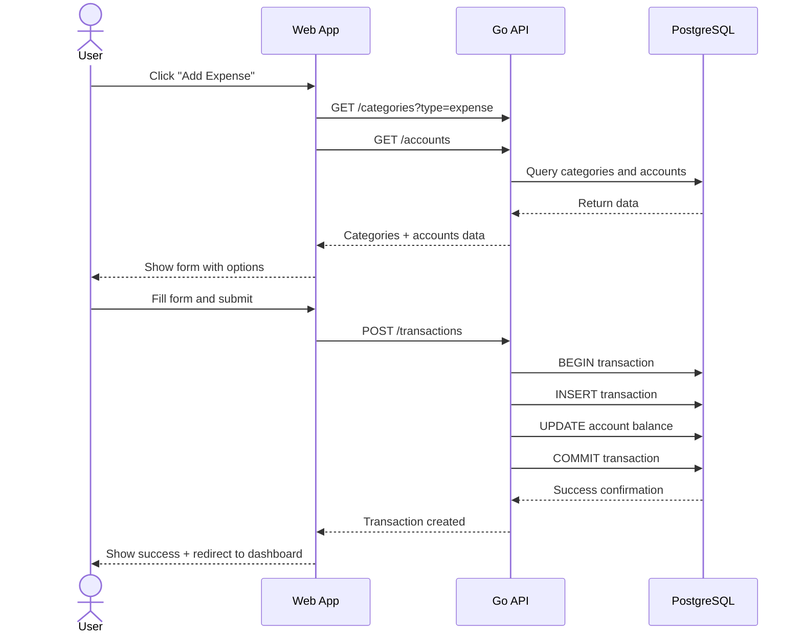

##### Algorithm
1. User navigates to add transaction form
2. System loads current categories and accounts for family
3. User fills transaction details (amount, category, account, date)
4. System validates input data
5. System creates transaction record
6. System updates account balance atomically
7. System shows confirmation and returns to dashboard

##### Preconditions
- User is authenticated with valid JWT token
- User has access to family financial data
- Family has at least one account and one category configured

##### Trigger
User clicks "Add Income" or "Add Expense" button from dashboard or menu.

##### Basic Flow
1. **Form Loading**: Load and display transaction form with categories/accounts
2. **Data Entry**: User enters amount, selects category, account, and date
3. **Validation**: Client-side validation (required fields, amount format)
4. **Submission**: Submit transaction data to API
5. **Server Processing**: Validate, create transaction, update account balance
6. **Confirmation**: Display success message and refresh dashboard

##### Exception Paths
- **Invalid Amount**: Show error "Please enter valid amount"
- **Missing Required Fields**: Highlight missing fields with error messages
- **Server Error**: Show "Transaction failed, please try again" with retry option
- **Network Error**: Show offline mode message, queue transaction for retry

##### Acceptance Criteria
- Transaction is recorded with correct amount, category, account, and date
- Account balance is updated accurately
- Transaction appears in recent transactions list
- User receives confirmation of successful entry
- Form validation prevents invalid data submission

##### Postconditions
- New transaction record exists in database
- Account balance reflects the transaction
- Transaction is visible in family financial reports
- Audit log contains transaction creation record
<br />


#### 2.3.2 Family Budget Overview
##### Sequence diagram
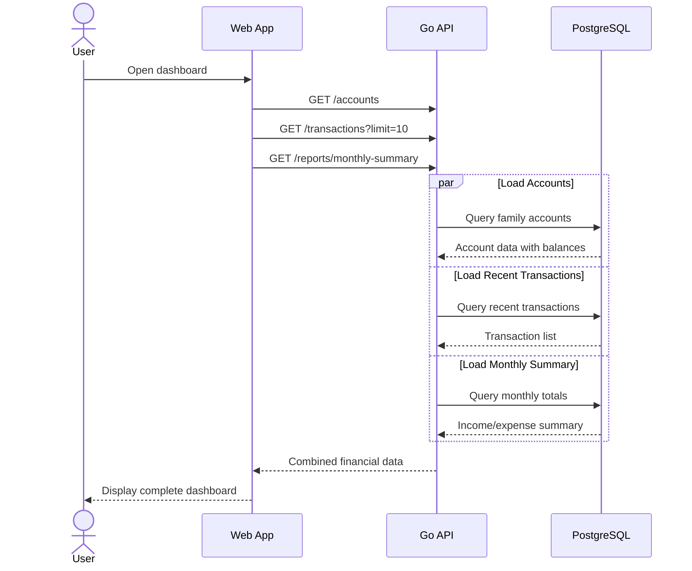

##### Algorithm
1. User opens dashboard
2. System loads current account balances
3. System loads recent transactions (last 10)
4. System calculates monthly summary (income vs expenses)
5. System displays comprehensive financial overview
6. User can navigate to detailed views or add new transactions

##### Preconditions
- User is authenticated
- Family has financial data (accounts, transactions)

##### Trigger
User logs in or navigates to dashboard.

##### Basic Flow
1. **Dashboard Loading**: Load account balances and recent activity
2. **Summary Calculation**: Calculate monthly income and expenses
3. **Display Overview**: Show total balance, recent transactions, monthly summary
4. **User Actions**: Provide quick access to add new transactions or view reports

##### Exception Paths
- **No Data**: Show "Get started" message with setup instructions
- **Loading Error**: Show cached data if available, or error message
- **Slow Response**: Show loading indicators, load data progressively

##### Acceptance Criteria
- All account balances are current and accurate
- Recent transactions show latest family activity
- Monthly summary reflects current period totals
- Dashboard loads within 3 seconds
- User can quickly access main actions

##### Postconditions
- User has complete view of family financial status
- User can make informed decisions about spending
- User has quick access to transaction entry
<br />


#### 2.3.3 User Registration and Family Setup
##### Sequence diagram
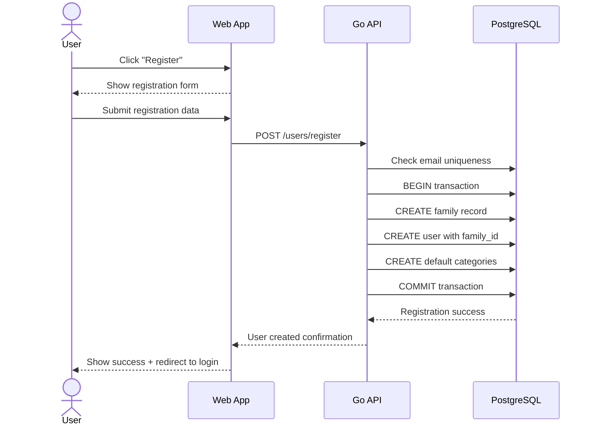

##### Algorithm
1. User navigates to registration form
2. User fills personal and family information
3. System validates data (email uniqueness, password strength)
4. System creates family entity
5. System creates user account linked to family
6. System sets up default categories for the family
7. System confirms registration and redirects to login

##### Preconditions
- User is not authenticated
- Email address is not already registered

##### Trigger
User clicks "Register" link from login screen or landing page.

##### Basic Flow
1. **Form Display**: Show registration form with required fields
2. **Data Collection**: Collect user info, family name, base currency
3. **Validation**: Validate email format, password strength, required fields
4. **Family Creation**: Create new family entity with specified settings
5. **User Account**: Create user account linked to family
6. **Default Setup**: Create default expense/income categories
7. **Confirmation**: Show success message and redirect to login

##### Exception Paths
- **Email Already Exists**: Show "Email already registered" error
- **Weak Password**: Show password requirements
- **Network Error**: Save form data locally, retry when connection restored
- **Server Error**: Show error message with retry option

##### Acceptance Criteria
- New family is created with specified name and base currency
- User account is created and linked to family
- Default categories are available for immediate use
- User can log in immediately after registration
- Email uniqueness is enforced

##### Postconditions
- Family entity exists with unique identifier
- User can authenticate and access family financial data
- Default categories are available for transaction entry
- System is ready for first transaction
<br />


#### 2.3.4 Monthly Financial Review
##### Sequence diagram
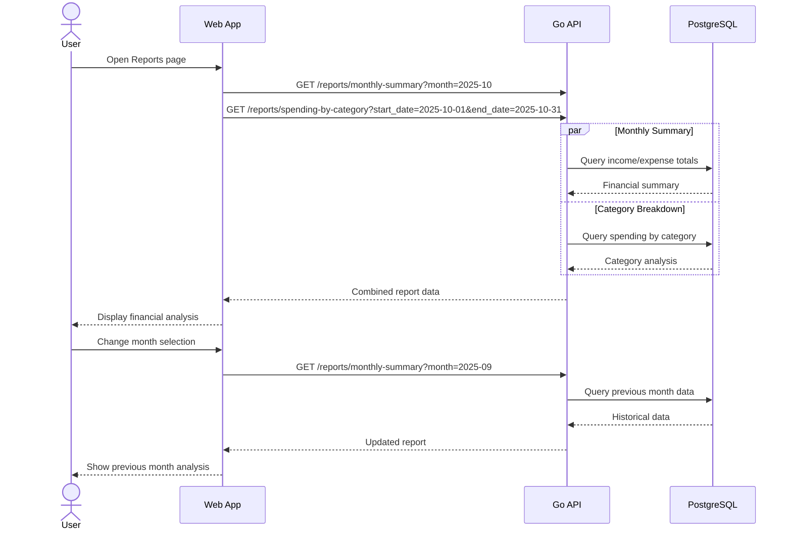

##### Algorithm
1. User opens reports screen
2. System loads current month financial summary
3. System loads spending breakdown by category
4. System displays income, expenses, savings rate
5. User can navigate between months for comparison
6. System provides insights into spending patterns

##### Preconditions
- User is authenticated
- Family has transaction history

##### Trigger
User navigates to Reports section from main menu.

##### Basic Flow
1. **Report Loading**: Load current month financial summary
2. **Data Analysis**: Calculate totals, percentages, trends
3. **Visualization**: Display charts and summaries
4. **Month Navigation**: Allow month-by-month review
5. **Insights**: Highlight spending patterns and savings

##### Exception Paths
- **No Data for Period**: Show "No transactions for this period"
- **Loading Error**: Show cached data if available
- **Currency Change**: Recalculate all amounts in selected currency

##### Acceptance Criteria
- Accurate calculation of income, expenses, and net savings
- Correct categorization of spending breakdown
- Month-to-month navigation works smoothly
- Savings rate calculated correctly
- Reports load within 5 seconds

##### Postconditions
- User understands monthly financial performance
- User can identify spending trends and patterns
- User has data to make informed financial decisions
<br />


#### 2.3.5 Account Balance Management
##### Sequence diagram
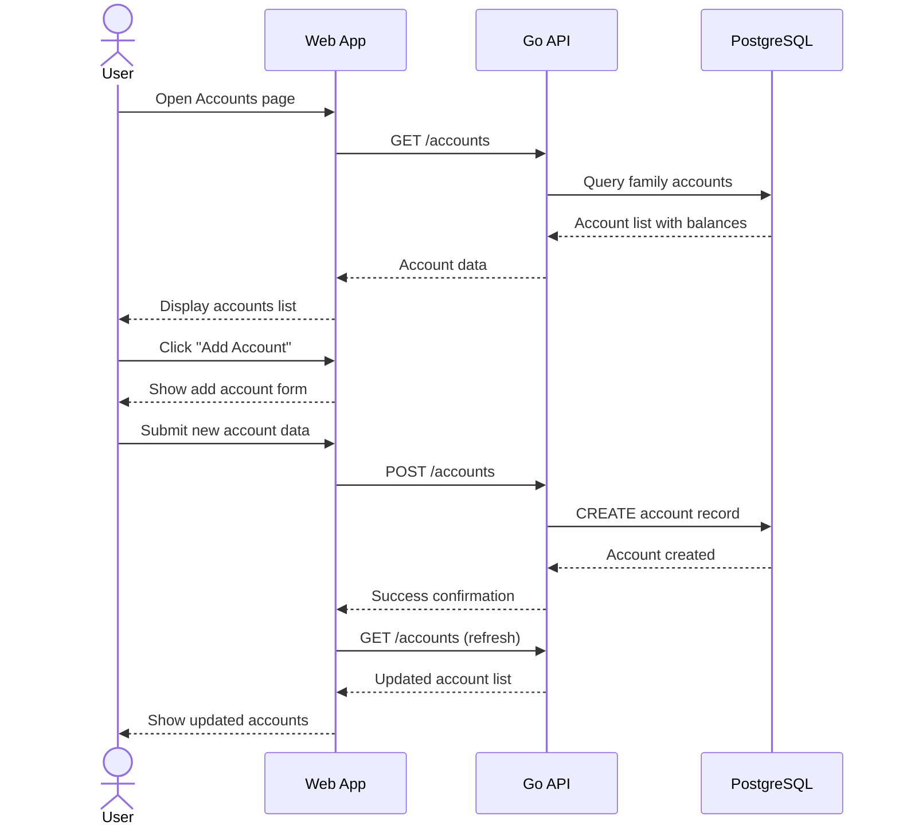

##### Algorithm
1. User opens account management screen
2. System displays all family accounts with current balances
3. User can add new accounts (cash, checking, savings)
4. User can edit account names and status
5. System maintains balance calculations automatically
6. User can view account transaction history

##### Preconditions
- User is authenticated
- User has family management permissions

##### Trigger
User navigates to Accounts section from main menu.

##### Basic Flow
1. **Account Display**: Show all family accounts with balances
2. **Account Creation**: Allow adding new accounts with type and currency
3. **Account Editing**: Enable editing account names and status
4. **Balance Tracking**: Display real-time calculated balances
5. **Account History**: Provide access to account transaction history

##### Exception Paths
- **Duplicate Account Name**: Show "Account name already exists"
- **Cannot Delete Account**: Show "Cannot delete account with transactions"
- **Balance Calculation Error**: Recalculate from transaction history

##### Acceptance Criteria
- All family accounts displayed with correct balances
- New accounts can be created with proper validation
- Account balances update automatically with transactions
- Account status changes reflect in transaction forms
- Total family balance calculated correctly

##### Postconditions
- Family has organized account structure
- Account balances are accurate and up-to-date
- Users can effectively track money across different accounts
<br />


#### 2.3.6 Transaction History Review
##### Sequence diagram
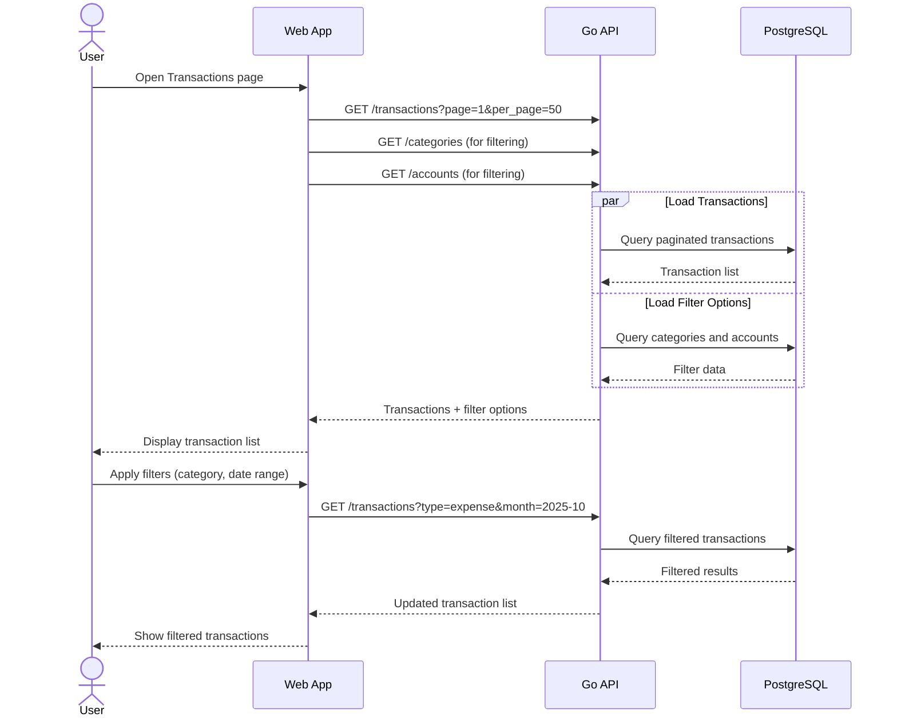

##### Algorithm
1. User opens transactions list screen
2. System loads recent transactions with pagination
3. System provides filtering options (type, category, account, date)
4. User can search and filter transaction history
5. User can click on transactions to view/edit details
6. System supports efficient pagination for large datasets

##### Preconditions
- User is authenticated
- Family has transaction history

##### Trigger
User navigates to Transactions section or clicks "View All" from dashboard.

##### Basic Flow
1. **Transaction Loading**: Load paginated transaction list
2. **Filter Setup**: Provide filtering options for search
3. **Search/Filter**: Allow filtering by multiple criteria
4. **Transaction Selection**: Enable viewing transaction details
5. **Pagination**: Support navigation through large transaction sets

##### Exception Paths
- **No Transactions Found**: Show "No transactions match your criteria"
- **Loading Timeout**: Show partial results with retry option
- **Filter Error**: Reset filters and show all transactions

##### Acceptance Criteria
- Transactions displayed in chronological order (newest first)
- Filtering works correctly for all criteria
- Pagination handles large transaction volumes efficiently
- Transaction details accessible from list view
- Search results are accurate and fast

##### Postconditions
- User can efficiently review family financial history
- User can find specific transactions quickly
- User has access to detailed transaction information
<br />


#### 2.3.7 Transaction Correction and Deletion
##### Sequence diagram
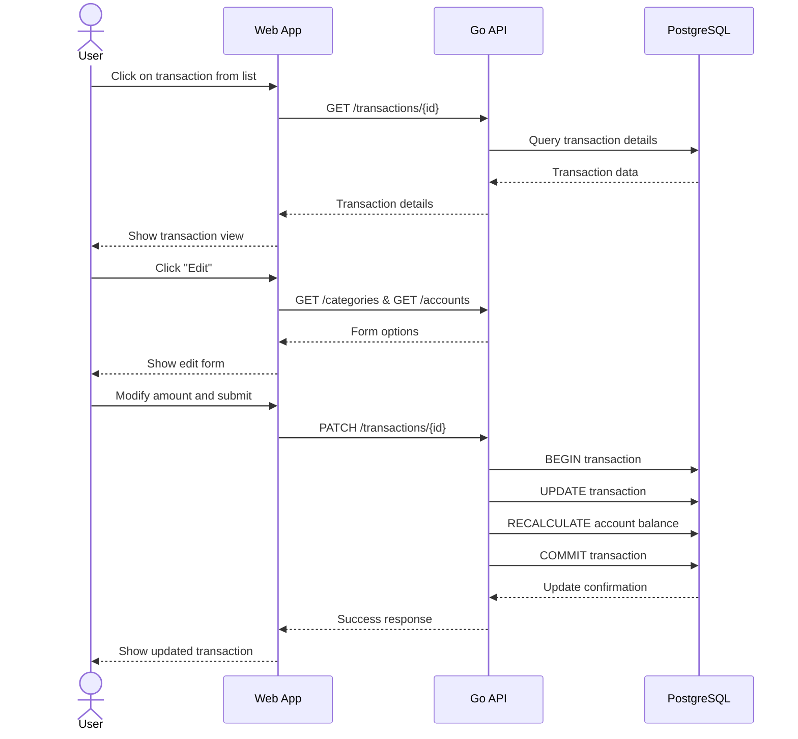

##### Algorithm
1. User selects transaction from list or dashboard
2. System displays transaction details in view mode
3. User enters edit mode to modify transaction
4. System pre-populates form with existing data
5. User makes changes and submits
6. System updates transaction and recalculates balances
7. System confirms changes and updates display

##### Preconditions
- User is authenticated
- Transaction exists and belongs to user's family
- User has edit permissions

##### Trigger
User clicks on transaction from list or dashboard, then clicks "Edit" or "Delete".

##### Basic Flow
1. **Transaction Selection**: User selects transaction to modify
2. **Detail Display**: Show transaction details in view mode
3. **Edit Mode**: Switch to editable form with current values
4. **Modification**: User changes amount, category, date, or description
5. **Validation**: Validate changes before submission
6. **Update Processing**: Update transaction and recalculate balances
7. **Confirmation**: Show success message and updated data

##### Exception Paths
- **Validation Errors**: Show field-specific error messages
- **Concurrent Modification**: Show "Transaction was modified" warning
- **Delete Confirmation**: Require confirmation before deletion
- **Balance Recalculation Error**: Show error and retry option

##### Acceptance Criteria
- All transaction fields can be modified except creation date
- Account balances update correctly after modification
- Deletion requires confirmation dialog
- Changes are immediately visible in transaction list
- Edit history is maintained for audit purposes

##### Postconditions
- Transaction reflects accurate information
- Account balances are correct after changes
- Transaction history maintains data integrity
- Audit log contains modification record
<br />


#### 2.3.8 Multi-Currency Transaction Handling
##### Sequence diagram
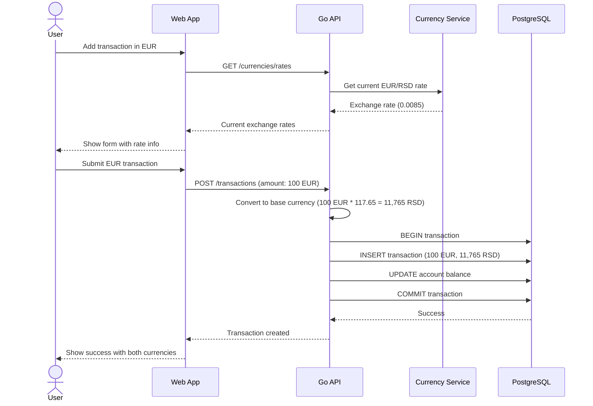

##### Algorithm
1. User selects non-base currency for transaction
2. System fetches current exchange rates
3. System displays conversion rate to user
4. User enters amount in selected currency
5. System converts to family base currency
6. System stores both original and converted amounts
7. System updates account balance in base currency

##### Preconditions
- User is authenticated
- Exchange rate service is available
- Family has accounts in multiple currencies

##### Trigger
User selects EUR currency when adding transaction (family base is RSD).

##### Basic Flow
1. **Currency Selection**: User chooses transaction currency
2. **Rate Retrieval**: System gets current exchange rate
3. **Rate Display**: Show conversion rate to user
4. **Amount Entry**: User enters amount in selected currency
5. **Conversion**: System calculates base currency equivalent
6. **Storage**: Store both original and converted amounts
7. **Balance Update**: Update account balance in base currency

##### Exception Paths
- **Rate Service Unavailable**: Use cached rates with warning
- **Invalid Currency**: Default to base currency
- **Conversion Error**: Show error and require base currency
- **Rate Fluctuation**: Show rate update notification

##### Acceptance Criteria
- Accurate currency conversion using current rates
- Both original and converted amounts stored
- Account balances maintained in family base currency
- Exchange rates updated regularly
- Conversion rate displayed to user before submission

##### Postconditions
- Transaction recorded in both currencies
- Account balance accurately reflects converted amount
- Currency information preserved for reporting
- Exchange rate used is logged for audit

---
<br />


### 2.4 Data Model

#### 2.4.1 Financial Data Management
##### Data model schema

###### ER diagram
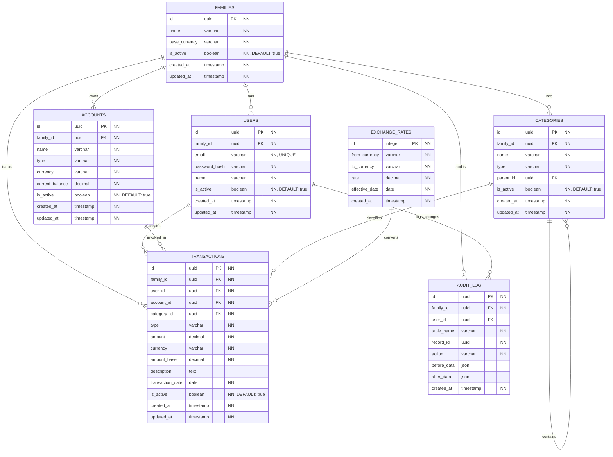
<br />

##### Table: _families_
###### Description
Represents a family unit that shares financial data. All financial information is scoped to family level.

###### Data model
| Name | Type | Required | Description | Validation |
|------|------|-----------|--------------|------------|
| id | UUID | Yes | Unique family identifier | Primary key |
| name | VARCHAR(255) | Yes | Family name (e.g., "Kudinov Family") | Length 1-255 chars |
| base_currency | VARCHAR(3) | Yes | Primary currency for calculations (RSD/EUR) | IN ('RSD', 'EUR') |
| is_active | BOOLEAN | Yes | Family account status | Default TRUE |
| created_at | TIMESTAMP | Yes | Record creation time | Auto-generated |
| updated_at | TIMESTAMP | Yes | Record last update time | Auto-updated |
<br />

##### Table: _users_
###### Description
Family members who have access to shared financial data.

###### Data model
| Name | Type | Required | Description | Validation |
|------|------|-----------|--------------|------------|
| id | UUID | Yes | Unique user identifier | Primary key |
| family_id | UUID | Yes | Reference to family | Foreign key to families.id |
| email | VARCHAR(255) | Yes | Unique email address | UNIQUE, valid email format |
| password_hash | VARCHAR(255) | Yes | Bcrypt hashed password | Bcrypt hash format |
| name | VARCHAR(255) | Yes | User display name | Length 1-255 chars |
| is_active | BOOLEAN | Yes | User account status | Default TRUE |
| created_at | TIMESTAMP | Yes | Record creation time | Auto-generated |
| updated_at | TIMESTAMP | Yes | Record last update time | Auto-updated |
<br />

##### Table: _accounts_
###### Description
Financial accounts (cash, bank accounts) managed by the family.

###### Data model
| Name | Type | Required | Description | Validation |
|------|------|-----------|--------------|------------|
| id | UUID | Yes | Unique account identifier | Primary key |
| family_id | UUID | Yes | Reference to family | Foreign key to families.id |
| name | VARCHAR(255) | Yes | Account display name | Length 1-255 chars |
| type | VARCHAR(50) | Yes | Account type | IN ('cash', 'checking', 'savings') |
| currency | VARCHAR(3) | Yes | Account currency | IN ('RSD', 'EUR') |
| current_balance | DECIMAL(15,2) | Yes | Current account balance | Calculated field, precision 15,2 |
| is_active | BOOLEAN | Yes | Account status | Default TRUE |
| created_at | TIMESTAMP | Yes | Record creation time | Auto-generated |
| updated_at | TIMESTAMP | Yes | Record last update time | Auto-updated |
<br />

##### Table: _categories_
###### Description
Transaction categories for income and expense classification with hierarchical support.

###### Data model
| Name | Type | Required | Description | Validation |
|------|------|-----------|--------------|------------|
| id | UUID | Yes | Unique category identifier | Primary key |
| family_id | UUID | Yes | Reference to family | Foreign key to families.id |
| name | VARCHAR(255) | Yes | Category display name | Length 1-255 chars |
| type | VARCHAR(20) | Yes | Category type | IN ('income', 'expense') |
| parent_id | UUID | No | Reference to parent category | Foreign key to categories.id |
| is_active | BOOLEAN | Yes | Category status | Default TRUE |
| created_at | TIMESTAMP | Yes | Record creation time | Auto-generated |
| updated_at | TIMESTAMP | Yes | Record last update time | Auto-updated |
<br />

##### Table: _transactions_
###### Description
Core financial transactions (income, expenses) recorded by family members.

###### Data model
| Name | Type | Required | Description | Validation |
|------|------|-----------|--------------|------------|
| id | UUID | Yes | Unique transaction identifier | Primary key |
| family_id | UUID | Yes | Reference to family | Foreign key to families.id |
| user_id | UUID | Yes | User who created transaction | Foreign key to users.id |
| account_id | UUID | Yes | Account involved in transaction | Foreign key to accounts.id |
| category_id | UUID | Yes | Transaction category | Foreign key to categories.id |
| type | VARCHAR(20) | Yes | Transaction type | IN ('income', 'expense') |
| amount | DECIMAL(15,2) | Yes | Transaction amount (always positive) | > 0, precision 15,2 |
| currency | VARCHAR(3) | Yes | Transaction currency | IN ('RSD', 'EUR') |
| amount_base | DECIMAL(15,2) | Yes | Amount in family base currency | > 0, precision 15,2 |
| description | TEXT | No | Optional transaction description | Max 1000 chars |
| transaction_date | DATE | Yes | Date when transaction occurred | <= current_date |
| created_at | TIMESTAMP | Yes | Record creation time | Auto-generated |
| updated_at | TIMESTAMP | Yes | Record last update time | Auto-updated |
<br />

##### Table: _exchange_rates_
###### Description
Currency exchange rates for multi-currency transaction support.

###### Data model
| Name | Type | Required | Description | Validation |
|------|------|-----------|--------------|------------|
| id | INTEGER | Yes | Unique exchange rate identifier | Primary key, auto-increment |
| from_currency | VARCHAR(3) | Yes | Source currency code | IN ('RSD', 'EUR') |
| to_currency | VARCHAR(3) | Yes | Target currency code | IN ('RSD', 'EUR') |
| rate | DECIMAL(10,6) | Yes | Exchange rate value | > 0, precision 10,6 |
| effective_date | DATE | Yes | Date when rate is effective | Valid date |
| created_at | TIMESTAMP | Yes | Record creation time | Auto-generated |
<br />

##### Table: _audit_log_
###### Description
Tracks all significant changes to financial data for accountability and debugging.

###### Data model
| Name | Type | Required | Description | Validation |
|------|------|-----------|--------------|------------|
| id | UUID | Yes | Unique audit record identifier | Primary key |
| family_id | UUID | Yes | Reference to family | Foreign key to families.id |
| user_id | UUID | No | User who made the change | Foreign key to users.id |
| table_name | VARCHAR(100) | Yes | Database table affected | Valid table name |
| record_id | UUID | Yes | ID of affected record | Valid UUID |
| action | VARCHAR(20) | Yes | Action performed | IN ('INSERT', 'UPDATE', 'DELETE') |
| before_data | JSON | No | Data before change | Valid JSON |
| after_data | JSON | No | Data after change | Valid JSON |
| created_at | TIMESTAMP | Yes | When change occurred | Auto-generated |
 <br />

#### 2.4.2 Database Indexes and Performance

##### Critical Indexes
:books: _Essential indexes for application performance and data integrity._
| Table | Index Name | Columns | Type | Purpose |
|-------|------------|---------|------|---------|
| users | idx_users_email | email | UNIQUE | Authentication, email uniqueness |
| users | idx_users_family | family_id | BTREE | Family user lookup |
| transactions | idx_transactions_family_date | family_id, transaction_date | BTREE | Monthly reports, dashboard |
| transactions | idx_transactions_account | account_id | BTREE | Account balance calculation |
| transactions | idx_transactions_category | category_id | BTREE | Category reports |
| transactions | idx_transactions_user | user_id | BTREE | User transaction history |
| accounts | idx_accounts_family | family_id | BTREE | Family accounts lookup |
| categories | idx_categories_family_type | family_id, type | BTREE | Category filtering |
| exchange_rates | idx_rates_currency_date | from_currency, to_currency, effective_date | BTREE | Rate lookup |
| audit_log | idx_audit_family_table | family_id, table_name | BTREE | Audit queries |
<br />

##### Performance Considerations
- **Transactions table**: Partitioning by transaction_date for large datasets
- **Current_balance**: Maintained via triggers, not calculated on-demand
- **Exchange rates**: Cache frequently used rates in application
- **Audit log**: Archive old records periodically
<br />

#### 2.4.3 Data Validation Rules

##### Business Rules and Constraints
| Table | Field | Validation Rule | Error Message |
|-------|-------|----------------|---------------|
| transactions | amount | CHECK (amount > 0) | "Transaction amount must be positive" |
| transactions | type | CHECK (type IN ('income', 'expense')) | "Invalid transaction type" |
| transactions | currency | CHECK (currency IN ('RSD', 'EUR')) | "Unsupported currency" |
| transactions | transaction_date | CHECK (transaction_date <= CURRENT_DATE) | "Future dates not allowed" |
| accounts | type | CHECK (type IN ('cash', 'checking', 'savings')) | "Invalid account type" |
| accounts | currency | CHECK (currency IN ('RSD', 'EUR')) | "Unsupported currency" |
| accounts | current_balance | Calculated field | "Balance cannot be manually set" |
| categories | type | CHECK (type IN ('income', 'expense')) | "Invalid category type" |
| families | base_currency | DEFAULT 'RSD', CHECK (base_currency = 'RSD') | "MVP: Only RSD supported as base currency" |
| exchange_rates | rate | CHECK (rate > 0) | "Exchange rate must be positive" |
| users | email | UNIQUE constraint | "Email already exists" |
<br />

##### Data Integrity Rules
- **Family isolation**: All data access filtered by family_id
- **Soft deletes**: Use is_active flag for logical deletion (transactions, accounts, categories, users)
- **Audit trail**: All CUD operations logged in audit_log table
- **Balance consistency**: Account balances recalculated via triggers
- **Currency consistency**: Base currency amounts always maintained
<br />

#### 2.4.4 Database Triggers and Automation

##### Balance Calculation Trigger
```sql
-- Automatically update account balance when transaction is inserted/updated/deleted
CREATE OR REPLACE FUNCTION update_account_balance()
RETURNS TRIGGER AS $$
BEGIN
    -- Recalculate account balance based on all transactions
    UPDATE accounts 
    SET current_balance = (
        SELECT COALESCE(
            SUM(CASE 
                WHEN t.type = 'income' THEN t.amount_base 
                WHEN t.type = 'expense' THEN -t.amount_base 
            END), 0)
        FROM transactions t 
        WHERE t.account_id = COALESCE(NEW.account_id, OLD.account_id)
    )
    WHERE id = COALESCE(NEW.account_id, OLD.account_id);
    
    RETURN COALESCE(NEW, OLD);
END;
$$ LANGUAGE plpgsql;
```
<br />

##### Audit Log Trigger
```sql
-- Automatically log all changes to financial data
CREATE OR REPLACE FUNCTION audit_trigger()
RETURNS TRIGGER AS $$
BEGIN
    INSERT INTO audit_log (
        family_id, user_id, table_name, record_id, action, 
        before_data, after_data, created_at
    ) VALUES (
        COALESCE(NEW.family_id, OLD.family_id),
        CURRENT_SETTING('app.current_user_id', true)::UUID,
        TG_TABLE_NAME,
        COALESCE(NEW.id, OLD.id),
        TG_OP,
        CASE WHEN TG_OP != 'INSERT' THEN row_to_json(OLD) END,
        CASE WHEN TG_OP != 'DELETE' THEN row_to_json(NEW) END,
        NOW()
    );
    
    RETURN COALESCE(NEW, OLD);
END;
$$ LANGUAGE plpgsql;
```

---
<br />


### 2.5 Metrics and Alerts

#### 2.5.1 Metrics
Critical monitoring metrics for MVP operation.
<br />

##### :bar_chart: Essential System Metrics
| Service | Metric name | Alert Threshold | Description |
|---------|-------------|----------------|-------------|
| Go API | API Health | <95% success rate | System availability |
| Go API | Response Time | >3000ms (95th percentile) | User experience |
| PostgreSQL | Connection Health | <5 available connections | Database capacity |
| Authentication | Login Success | <90% success rate | Auth system health |
| Transactions | Processing Errors | >1% failure rate | Business logic reliability |
| Currency | Rate Updates | >2 failures/hour | Multi-currency support |
<br />

#### 2.5.2 Alerts
Essential alerts for MVP system health.

##### :rotating_light: Critical Alerts
- **System Down**: API health check fails >2 minutes
- **Database Unavailable**: PostgreSQL connection fails >1 minute
- **Transaction Failures**: >5% transaction processing errors in 10 minutes
- **Authentication Issues**: >20 failed logins in 2 hours

##### :incoming_envelope: Alert Delivery (MVP)
- **Application Logs**: Structured logging with alert severity
- **Console Output**: Critical alerts only
- **External Monitoring**: Standard HTTP response codes indicate API health

---
<br />


## 3. Non-functional Requirements
### 3.1 Configuration
#### Environment Configuration:
- **Development**: Local Go server with local PostgreSQL database
- **Production**: Single Docker container with configurable PostgreSQL connection

#### Application Configuration:
- **Database**: Connection URL, pool size (default: 10 connections)
- **JWT**: Secret key, expiration time (default: 24 hours)  
- **Currency API**: Update frequency (default: daily), fallback rates
- **Server**: Port (default: 8080), CORS settings for web client

#### Security Configuration:
- **Password Policy**: Minimum 8 characters (configurable)
- **Rate Limiting**: 100 requests per minute per user (configurable)
- **Session Timeout**: 24 hours (configurable)

#### Reference Data Management (MVP):
- **Categories**: Pre-configured via SQL migration scripts
- **Currencies**: RSD and EUR supported via database configuration
- **Account Types**: Configured during database initialization
- **Post-MVP**: Administrative UI for reference data management
<br />


### 3.2 General Non-functional Requirements
#### Parallel Work of Multiple Users
##### Family Data Access:
_The MVP system supports concurrent access by family members with proper data isolation:_

- **Family Isolation**: All database queries include family_id filtering to prevent cross-family data access
- **Concurrent Transactions**: PostgreSQL transactions ensure account balance consistency
- **Session Management**: Multiple family members can be logged in simultaneously
- **Data Consistency**: Account balances are calculated atomically during transaction creation

##### Conflict Resolution (Basic):
- **Account Updates**: Last-write-wins for account balance modifications
- **Concurrent Entry**: No special handling for simultaneous transaction entry (rare in family context)
<br />

#### Audit Log Storage and Management
##### Essential Audit Trail:
Track critical financial operations for accountability and troubleshooting.

##### Logged Actions (MVP):
- **User Authentication**: Login attempts and password changes
- **Financial Transactions**: Creation, modification, deletion of transactions
- **Account Changes**: Balance updates and account modifications

##### Audit Log Structure:
- **Event Metadata**: Timestamp, user_id, family_id, action type
- **Data Changes**: Before/after values for change tracking
- **Retention**: 1-year retention (sufficient for MVP)
<br />

#### Performance, Scalability, and Reliability Expectations
##### Performance Requirements:
- **API Response Time**: <2 seconds for standard operations (matches BRD requirement)
- **Page Load Time**: <3 seconds for web interface
- **Database Queries**: <500ms for individual operations

##### Scalability Targets (MVP):
- **Concurrent Users**: Support 10 simultaneous family users
- **Data Volume**: Handle 1,000+ transactions per family efficiently
- **Database Size**: Accommodate up to 100MB of financial data

##### Reliability Standards:
- **System Availability**: 95% uptime during development/testing
- **Data Integrity**: Zero financial data loss with database ACID compliance
- **Error Recovery**: Graceful degradation when external services unavailable

##### Offline Behavior (MVP):
- The system does not support full offline mode.  
- When the network is unavailable, the client must show a clear error message and prevent unsynchronized data from being lost silently.  
- No sensitive financial data is required to be stored locally on client devices beyond standard browser caching.
<br />

#### Security and Compliance Notes
##### Data Security (MVP):
- **Encryption in Transit**: All API communications over HTTPS
- **Password Security**: Bcrypt hashing with 12 rounds minimum
- **Session Security**: JWT tokens with family context, secure storage

##### Authentication and Authorization:
- **Family-based Access**: Users only access their family's financial data
- **JWT Validation**: All API endpoints validate JWT tokens
- **Rate Limiting**: Basic protection against brute force attacks

##### Privacy and Compliance:
- **Data Minimization**: Collect only necessary financial information
- **Data Deletion**: Family data can be permanently deleted on request
- **Post-MVP**: Advanced data export and compliance features

##### Operational Security (MVP):
- **Input Validation**: Prevent SQL injection and XSS attacks
- **Error Handling**: Don't expose sensitive information in error messages
- **Logging**: Security events logged for review

##### Post-MVP Security Features:
- **Multi-factor Authentication**: Enhanced account security
- **Database Encryption**: Field-level encryption for sensitive data
- **Advanced Monitoring**: Real-time security monitoring and alerting

---