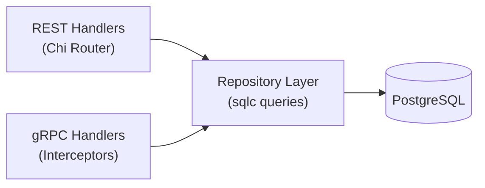
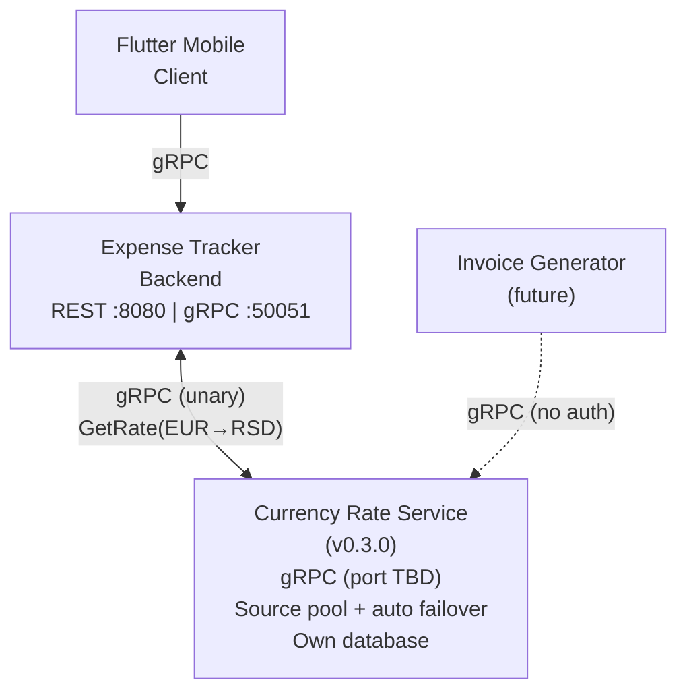
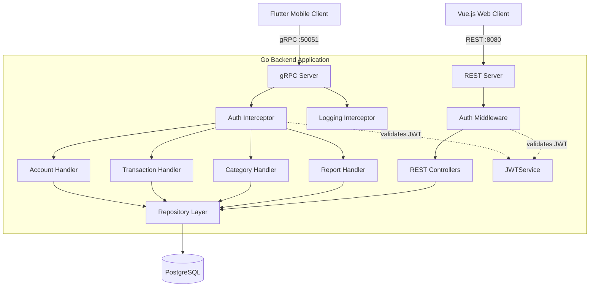
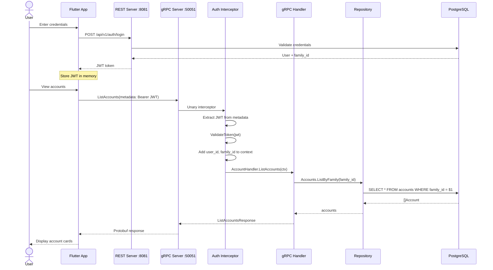
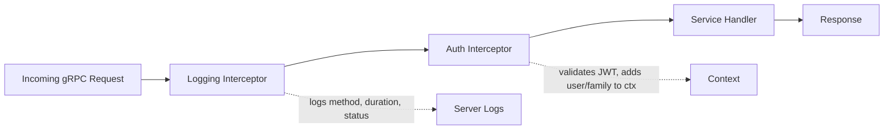
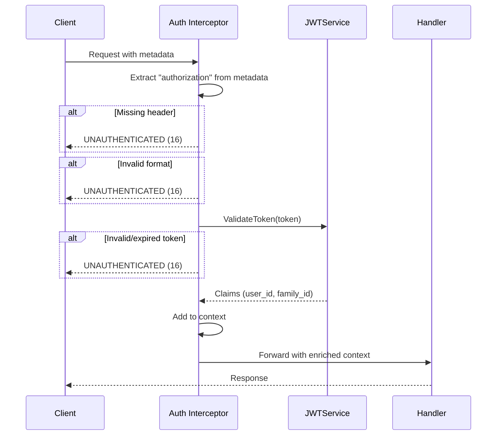

# Expense Tracker - Technical Design Document (gRPC Integration)

# 1. Document Overview
- **Document Owner:** Igor Kudinov — Business & System Analyst
- **Date / Version:** March 18, 2026 / v1.0
- **Related Documents:** BRD v1.0, SRS MVP v1.0
- **Related Initiatives:** Dual-Protocol Architecture, Mobile Client Preparation

---

# 2. Executive Summary

This document specifies the technical design for adding a **complete gRPC API layer** to the Expense Tracker backend, establishing a dual-protocol architecture where the web client communicates via REST and mobile clients communicate via gRPC — both sharing the same repository layer with zero business logic duplication.

**Full gRPC API Scope**

The gRPC API provides **full functional parity** with the existing REST API defined in the SRS MVP, organized into 5 services with 16 RPC methods:

| Service | Methods | Coverage |
|---------|---------|----------|
| AuthService | Login, ValidateToken | Authentication and token management |
| AccountService | List, Create, Update, Delete | Full account CRUD |
| TransactionService | List, Create, Update, Delete | Full transaction CRUD with filters |
| CategoryService | List, Create, Update, Delete | Full category CRUD with hierarchy |
| ReportService | SpendingByCategory, MonthlySummary | Financial analytics |

**Demo Implementation Note**

> :information_source: For the initial demo release (v0.4.0), **2 of 16 methods** are implemented: `AccountService.ListAccounts` and `TransactionService.ListTransactions`. These two methods demonstrate the complete gRPC pipeline end-to-end (proto → codegen → interceptors → handlers → shared repository → database). The remaining 14 methods follow identical architectural patterns and are specified in this document for future implementation.

**Business Context**
- **Portfolio demonstration** of inter-service communication patterns relevant to fintech SA positions
- **Plata Card interview readiness** — REST/gRPC knowledge is a requirement across all three open positions
- **Mobile API foundation** — efficient binary protocol for the Flutter mobile client (v0.4.0)
- **Inter-service communication foundation** — gRPC serves as the standard protocol beyond mobile, starting with Currency Rate Service (v0.3.0) and extending to future microservices (see ADR-6)

---

# 3. Architecture Decision Records

## ADR-1: Why gRPC for Mobile, Not REST?

| Criteria | REST | gRPC |
|----------|------|------|
| Data format | JSON (text, ~4x larger) | Protocol Buffers (binary, compact) |
| Contract | OpenAPI/Swagger (optional) | Proto files (mandatory, strict) |
| Code generation | Manual or tool-assisted | Built-in from proto definitions |
| Mobile bandwidth | Higher (JSON verbosity) | Lower (binary serialization) |
| Type safety | Runtime validation | Compile-time guarantees |
| Streaming | Requires WebSocket | Native support (4 types) |

**Decision:** Use gRPC for mobile client communication.

**Rationale:** Binary serialization saves bandwidth on mobile networks (measured 44-75% reduction in demo). Strict proto contracts provide reliable client-server integration. Native code generation for Dart/Flutter eliminates manual client implementation.

**Tradeoff:** Web client remains on REST because browsers don't natively support HTTP/2 gRPC — grpc-web proxy would add infrastructure complexity without meaningful benefit.


## ADR-2: Shared Repository Layer

**Decision:** Both REST handlers and gRPC handlers call the same `repository.Repositories` interface.

**Rationale:**
- Single source of truth for data access patterns
- Database queries maintained in one place (sqlc)
- Changes to business rules automatically apply to both protocols
- Reduces testing surface — repository tests cover both paths



## ADR-3: Auth via REST, Token in gRPC Metadata

**Decision:** Authentication endpoint remains REST-only. JWT token is passed to gRPC calls via metadata header `authorization: Bearer <token>`.

**Rationale:**
- Login is a one-time operation — no performance benefit from gRPC
- REST login endpoint already exists and is tested
- JWT token works identically in both protocols — same `JWTService.ValidateToken()`
- gRPC auth interceptor mirrors REST auth middleware pattern

**Note:** `AuthService` proto is designed for future use (e.g., token refresh via gRPC, mobile-native auth flow). Current demo uses REST for login.


## ADR-4: Plaintext gRPC (No TLS) for Demo

**Decision:** gRPC server listens on port 50051 without TLS encryption.

**Rationale:**
- Demo environment — not production
- Cloudflare free plan does not proxy gRPC traffic
- Direct IP access required for external gRPC clients
- TLS can be added for production without architectural changes


## ADR-5: Proto File Organization (Flat Structure)

**Decision:** Proto files stored in flat `proto/` directory at repository root, not nested `proto/expense_tracker/v1/`.

**Rationale:**
- `paths=source_relative` in `buf.gen.yaml` reproduces directory structure in output
- Flat source → flat output in `internal/grpc/pb/`
- Simplifies import paths in Go handlers
- Lesson learned during initial setup (nested structure caused import path issues)


## ADR-6: gRPC Beyond Mobile — Inter-Service Communication Protocol

**Context:** The current design positions gRPC exclusively as a mobile client protocol. However, the gRPC layer architecture is designed universally and will serve as the standard protocol for inter-service communication as the system evolves toward a microservice architecture.

**Decision:** gRPC is adopted not only for mobile client communication but as the standard inter-service protocol across the Expense Tracker ecosystem.

**First planned consumer — Currency Rate Service (v0.3.0):**

An autonomous microservice responsible for collecting live exchange rates from configurable external sources (web scraping or public APIs) and persisting them to its own database. Any application can make an unauthenticated gRPC request to retrieve the current rate on demand.

Key characteristics:
- The service periodically polls configured external sources and writes rates to its own database — clients never hit external sources directly
- Each currency pair has a **primary source** configured from a pool of available providers
- An optional **backup source** can be enabled per currency pair, selected from the same pool (excluding the primary). If the primary source fails during a polling cycle, the service automatically falls over to the backup source
- **Unauthenticated access** — exchange rates are public data; any application in the infrastructure can request a rate without JWT

**Role in Expense Tracker (pre-v1.0):**

The Currency Rate Service is **informational only** through v1.0. The primary currency is RSD, but many expenses are paid in EUR or other currencies. The service provides an approximate equivalent for visibility purposes — not for financial-grade calculations.

**Design principle: no stale rates.** If both primary and backup sources fail, the service returns a "rate unavailable" response rather than serving a cached stale rate. In the current geopolitical and economic climate, exchange rates are highly volatile — an outdated rate displayed without indication of staleness would lead to incorrect mental calculations by the user, which is worse than showing no rate at all.

> Post-v1.0: a more robust rate reliability strategy will be designed (guaranteed freshness windows, staleness indicators, mandatory rate availability for certain operations). This is explicitly out of scope for the current design.

**Future consumers:**

| Consumer | Relationship | Timeline |
|----------|-------------|----------|
| Expense Tracker Backend | Primary consumer — rate lookup during multi-currency transaction display | v0.3.0 |
| Flutter Mobile Client | Indirect — via Expense Tracker Backend | v0.5.0 |
| Invoice Generator | Direct consumer — currency conversion for international invoices | Future |

**Rationale:**
- Proto files enforce a strict contract between services — API changes break at compile time, not at runtime
- Binary serialization is more efficient than JSON for frequent inter-service calls (rate lookups may occur on every transaction view)
- Shared tooling — buf, protoc, interceptors — is already established in the project
- The "shared proto repository" pattern scales to N services

**Architecture impact:**



**Auth model difference:**

| Consumer | Auth | Reason |
|----------|------|--------|
| Flutter Mobile → Expense Tracker gRPC | JWT required | User data, family isolation |
| Expense Tracker → Currency Rate Service | No auth | Public exchange rate data, internal infrastructure |
| Invoice Generator → Currency Rate Service | No auth | Same — utility service, no sensitive data |

**Tradeoff:** Adds a network dependency — if Currency Rate Service is entirely unavailable, the Expense Tracker gracefully degrades by showing "rate unavailable" instead of currency equivalents. No fallback to stale data. This is acceptable for the informational role pre-v1.0.

---

# 4. System Architecture

## 4.1 Components Diagram



## 4.2 Port Allocation

| Port | Protocol | Service | Access |
|------|----------|---------|--------|
| 80/443 | HTTP/HTTPS | nginx-proxy (existing on Hetzner) | Handles TLS for other services on the VPS |
| 8080 | HTTP/REST | Backend (inside Docker container) | Internal only — mapped to :8081 externally (port 8080 occupied by Camunda) |
| 8081 | HTTP/REST | Backend (Docker → host) | Cloudflare Tunnel → `api-demo-expensetracker.digitlock.systems` / Direct IP `46.224.29.194:8081` |
| 8090 | HTTP | Frontend (Docker nginx → host) | Cloudflare Tunnel → `demo-expensetracker.digitlock.systems` (port 80 occupied by nginx-proxy) |
| 50051 | HTTP/2 gRPC | gRPC API (Docker → host) | Direct IP `46.224.29.194:50051` (plaintext, Cloudflare does not proxy gRPC on free plan) |
| 5432 | TCP | PostgreSQL (Docker) | Internal only (Docker network `backend`) |


## 4.3 Request Flow — gRPC with Authentication



## 4.4 Interceptor Chain



Interceptors are chained using `grpc.ChainUnaryInterceptor()`:
1. **Logging Interceptor** — logs method name, execution duration, and gRPC status code
2. **Auth Interceptor** — extracts JWT from metadata, validates via `JWTService`, injects `user_id` and `family_id` into request context

### gRPC Error Responses (Auth)
| Condition | gRPC Status Code | Message |
|-----------|-----------------|---------|
| No authorization header | `16 UNAUTHENTICATED` | `missing authorization header` |
| Invalid Bearer format | `16 UNAUTHENTICATED` | `invalid authorization format` |
| Expired/invalid JWT | `16 UNAUTHENTICATED` | `invalid token` |
| Valid token | `0 OK` | *(request proceeds to handler)* |

---

# 5. Protocol Buffer Definitions

## 5.1 AuthService (`auth.proto`)


```protobuf
syntax = "proto3";
package expense_tracker.v1;
option go_package = "github.com/DigitLock/expense-tracker/internal/grpc/pb";

service AuthService {
  rpc Login(LoginRequest) returns (LoginResponse);
  rpc ValidateToken(ValidateTokenRequest) returns (ValidateTokenResponse);
}
```

### RPC: Login
**Description**
Authenticates a user and returns a JWT token with family context.

**Request Parameters**
| Field | Type | Required | Description | Example |
|-------|------|----------|-------------|---------|
| email | string | Yes | User email address | `demo@example.com` |
| password | string | Yes | User password | `Demo123!` |

**Response Parameters**
| Field | Type | Description | Example |
|-------|------|-------------|---------|
| token | string | JWT authentication token | `eyJhbGci...` |
| user | User | Authenticated user info | See User message |
| expires_in | int32 | Token TTL in seconds | `86400` |

```protobuf
message LoginRequest {
  string email = 1;
  string password = 2;
}

message LoginResponse {
  string token = 1;
  User user = 2;
  int32 expires_in = 3;
}

message User {
  string id = 1;
  string email = 2;
  string name = 3;
  string family_id = 4;
}
```

### RPC: ValidateToken
**Description**
Validates an existing JWT token and returns user context. Useful for mobile app session restoration.

**Request Parameters**
| Field | Type | Required | Description | Example |
|-------|------|----------|-------------|---------|
| token | string | Yes | JWT token to validate | `eyJhbGci...` |

**Response Parameters**
| Field | Type | Description | Example |
|-------|------|-------------|---------|
| valid | bool | Token validity | `true` |
| user | User | User info (if valid) | See User message |

```protobuf
message ValidateTokenRequest {
  string token = 1;
}

message ValidateTokenResponse {
  bool valid = 1;
  User user = 2;
}
```

---

## 5.2 AccountService (`accounts.proto`)

```protobuf
syntax = "proto3";
package expense_tracker.v1;
option go_package = "github.com/DigitLock/expense-tracker/internal/grpc/pb";

import "google/protobuf/timestamp.proto";

service AccountService {
  rpc ListAccounts(ListAccountsRequest) returns (ListAccountsResponse);
  rpc CreateAccount(CreateAccountRequest) returns (AccountResponse);
  rpc UpdateAccount(UpdateAccountRequest) returns (AccountResponse);
  rpc DeleteAccount(DeleteAccountRequest) returns (DeleteResponse);
}
```

### RPC: ListAccounts

**Description**
Returns all active accounts for the authenticated user's family with current balances.

**Authorization**
:closed_lock_with_key: JWT Bearer token required in gRPC metadata.

**Request Parameters**
| Field | Type | Required | Description |
|-------|------|----------|-------------|
| *(none)* | — | — | Family ID extracted from JWT via auth interceptor |

**Response Parameters**
| Field | Type | Description | Example |
|-------|------|-------------|---------|
| accounts | repeated Account | List of family accounts | See Account message |
| total | int32 | Total number of accounts | `4` |

**Account Message**
```protobuf
message Account {
  string id          = 1;
  string name        = 2;
  string type        = 3;          // "cash", "checking", "savings"
  string currency    = 4;          // "RSD", "EUR"
  double balance     = 5;
  string description = 6;
  bool   is_active   = 7;
  google.protobuf.Timestamp created_at = 8;
  google.protobuf.Timestamp updated_at = 9;
}
```

**grpcurl Example**
```bash
grpcurl -plaintext \
  -import-path . -proto proto/accounts.proto \
  -H "authorization: Bearer $TOKEN" \
  -d '{}' \
  46.224.29.194:50051 \
  expense_tracker.v1.AccountService/ListAccounts
```

### RPC: CreateAccount

**Description**
Creates a new account for the authenticated user's family.

**Authorization**
:closed_lock_with_key: JWT Bearer token required in gRPC metadata.

**Request Parameters**
| Field | Type | Required | Description | Validation | Example |
|-------|------|----------|-------------|------------|---------|
| name | string | Yes | Account display name | Non-empty, max 100 chars | `Cash EUR` |
| type | string | Yes | Account type | One of: `cash`, `checking`, `savings` | `cash` |
| currency | string | Yes | Account currency | One of: `RSD`, `EUR` | `EUR` |
| initial_balance | double | No | Starting balance (default: 0.00) | Non-negative | `500.00` |
| description | string | No | Optional account description | Max 255 chars | `Euro cash wallet` |

**Response Parameters**
| Field | Type | Description | Example |
|-------|------|-------------|---------|
| account | Account | Created account object | See Account message (5.2) |

**Error Responses**
| Condition | gRPC Status Code | Message |
|-----------|-----------------|---------|
| Missing required field (name, type, currency) | `3 INVALID_ARGUMENT` | `name is required` |
| Invalid account type | `3 INVALID_ARGUMENT` | `invalid account type` |
| Invalid currency | `3 INVALID_ARGUMENT` | `invalid currency` |
| Duplicate account name within family | `6 ALREADY_EXISTS` | `account with this name already exists` |
| Unauthenticated | `16 UNAUTHENTICATED` | `missing authorization header` |

```protobuf
message CreateAccountRequest {
  string name = 1;          // Required: account display name
  string type = 2;          // Required: "cash", "checking", "savings"
  string currency = 3;      // Required: "RSD" or "EUR"
  double initial_balance = 4; // Optional: starting balance (default: 0.00)
  string description = 5;   // Optional
}

message AccountResponse {
  Account account = 1;
}
```

**grpcurl Example**
```bash
grpcurl -plaintext \
  -import-path . -proto proto/accounts.proto \
  -H "authorization: Bearer $TOKEN" \
  -d '{"name": "Cash EUR", "type": "cash", "currency": "EUR", "initial_balance": 500.00, "description": "Euro cash wallet"}' \
  46.224.29.194:50051 \
  expense_tracker.v1.AccountService/CreateAccount
```

### RPC: UpdateAccount

**Description**
Updates an existing account. Partial update — only provided fields are modified. Account type and currency cannot be changed after creation.

**Authorization**
:closed_lock_with_key: JWT Bearer token required in gRPC metadata.

**Request Parameters**
| Field | Type | Required | Description | Validation | Example |
|-------|------|----------|-------------|------------|---------|
| id | string | Yes | Account UUID | Valid UUID format | `a1b2c3d4-...` |
| name | string | No | Updated display name | Non-empty if provided, max 100 chars | `Cash RSD Updated` |
| description | string | No | Updated description | Max 255 chars | `Updated description` |
| is_active | bool | No | Account active status | — | `false` |

> **Note:** In proto3, `bool` defaults to `false` and `string` defaults to empty — the handler must distinguish between "field not provided" and "field set to default value". Implementation should use field presence detection or wrapper types.

**Response Parameters**
| Field | Type | Description | Example |
|-------|------|-------------|---------|
| account | Account | Updated account object | See Account message (5.2) |

**Error Responses**
| Condition | gRPC Status Code | Message |
|-----------|-----------------|---------|
| Missing account ID | `3 INVALID_ARGUMENT` | `id is required` |
| Account not found | `5 NOT_FOUND` | `account not found` |
| Account belongs to different family | `7 PERMISSION_DENIED` | `access denied` |
| Duplicate account name within family | `6 ALREADY_EXISTS` | `account with this name already exists` |
| Unauthenticated | `16 UNAUTHENTICATED` | `missing authorization header` |

```protobuf
message UpdateAccountRequest {
  string id = 1;            // Required: account UUID
  string name = 2;          // Optional
  string description = 3;   // Optional
  bool is_active = 4;       // Optional
}
```

**grpcurl Example**
```bash
grpcurl -plaintext \
  -import-path . -proto proto/accounts.proto \
  -H "authorization: Bearer $TOKEN" \
  -d '{"id": "ACCOUNT_UUID", "name": "Cash RSD Updated"}' \
  46.224.29.194:50051 \
  expense_tracker.v1.AccountService/UpdateAccount
```

### RPC: DeleteAccount

**Description**
Soft-deletes an account by setting `is_active = false`. The account and its transaction history are preserved for audit purposes.

**Authorization**
:closed_lock_with_key: JWT Bearer token required in gRPC metadata.

**Request Parameters**
| Field | Type | Required | Description | Validation | Example |
|-------|------|----------|-------------|------------|---------|
| id | string | Yes | Account UUID | Valid UUID format | `a1b2c3d4-...` |

**Response Parameters**
| Field | Type | Description | Example |
|-------|------|-------------|---------|
| success | bool | Operation result | `true` |
| message | string | Human-readable result | `Account deactivated successfully` |

**Error Responses**
| Condition | gRPC Status Code | Message |
|-----------|-----------------|---------|
| Missing account ID | `3 INVALID_ARGUMENT` | `id is required` |
| Account not found | `5 NOT_FOUND` | `account not found` |
| Account belongs to different family | `7 PERMISSION_DENIED` | `access denied` |
| Account already inactive | `9 FAILED_PRECONDITION` | `account is already inactive` |
| Unauthenticated | `16 UNAUTHENTICATED` | `missing authorization header` |

```protobuf
message DeleteAccountRequest {
  string id = 1;            // Required: account UUID
}

message DeleteResponse {
  bool success = 1;
  string message = 2;
}
```

**grpcurl Example**
```bash
grpcurl -plaintext \
  -import-path . -proto proto/accounts.proto \
  -H "authorization: Bearer $TOKEN" \
  -d '{"id": "ACCOUNT_UUID"}' \
  46.224.29.194:50051 \
  expense_tracker.v1.AccountService/DeleteAccount
```

---

## 5.3 TransactionService (`transactions.proto`)

```protobuf
syntax = "proto3";
package expense_tracker.v1;
option go_package = "github.com/DigitLock/expense-tracker/internal/grpc/pb";

import "google/protobuf/timestamp.proto";

service TransactionService {
  rpc ListTransactions(ListTransactionsRequest) returns (ListTransactionsResponse);
  rpc CreateTransaction(CreateTransactionRequest) returns (TransactionResponse);
  rpc UpdateTransaction(UpdateTransactionRequest) returns (TransactionResponse);
  rpc DeleteTransaction(DeleteTransactionRequest) returns (DeleteResponse);
}
```

### RPC: ListTransactions

**Description**
Returns transactions for the authenticated user's family with filtering and pagination.

**Authorization**
:closed_lock_with_key: JWT Bearer token required in gRPC metadata.

**Request Parameters**
| Field | Type | Required | Description | Example |
|-------|------|----------|-------------|---------|
| type | optional string | No | Filter: `income`, `expense`, or empty | `expense` |
| account_id | optional string | No | Filter by account UUID | `a1b2c3d4-...` |
| month | optional string | No | Filter by month (YYYY-MM) | `2026-03` |
| page | int32 | No | Page number (default: 1) | `1` |
| per_page | int32 | No | Items per page (default: 10) | `10` |

**Response Parameters**
| Field | Type | Description | Example |
|-------|------|-------------|---------|
| transactions | repeated Transaction | Transaction list | See Transaction message |
| page | int32 | Current page | `1` |
| per_page | int32 | Items per page | `10` |
| total | int32 | Total matching | `16` |
| total_pages | int32 | Total pages | `2` |

**Transaction Message**
```protobuf
message Transaction {
  string id            = 1;
  string type          = 2;           // "income" or "expense"
  double amount        = 3;
  string currency      = 4;
  double amount_base   = 5;
  string base_currency = 6;
  string account_id    = 7;
  string category_id   = 8;
  string category_name = 9;
  string description   = 10;
  string date          = 11;          // YYYY-MM-DD
  google.protobuf.Timestamp created_at = 12;
  google.protobuf.Timestamp updated_at = 13;
}
```

**grpcurl Example**
```bash
grpcurl -plaintext \
  -import-path . -proto proto/transactions.proto \
  -H "authorization: Bearer $TOKEN" \
  -d '{"type": "expense", "page": 1, "per_page": 10}' \
  46.224.29.194:50051 \
  expense_tracker.v1.TransactionService/ListTransactions
```


### RPC: CreateTransaction

**Description**
Creates a new transaction for the authenticated user's family. Triggers automatic account balance recalculation via database trigger.

**Authorization**
:closed_lock_with_key: JWT Bearer token required in gRPC metadata.

**Request Parameters**
| Field | Type | Required | Description | Validation | Example |
|-------|------|----------|-------------|------------|---------|
| type | string | Yes | Transaction type | One of: `income`, `expense` | `expense` |
| amount | double | Yes | Transaction amount | Positive value | `2500.00` |
| currency | string | Yes | Transaction currency | One of: `RSD`, `EUR` | `RSD` |
| category_id | string | Yes | Category UUID | Valid UUID, must exist and be active | `cat_groceries_123` |
| account_id | string | Yes | Account UUID | Valid UUID, must exist and be active | `acc_cash_456` |
| description | string | No | Transaction description | Max 255 chars | `Weekly groceries at Maxi` |
| date | string | Yes | Transaction date | Format: `YYYY-MM-DD` | `2026-03-19` |

**Response Parameters**
| Field | Type | Description | Example |
|-------|------|-------------|---------|
| transaction | Transaction | Created transaction object | See Transaction message (5.3) |

**Error Responses**
| Condition | gRPC Status Code | Message |
|-----------|-----------------|---------|
| Missing required field | `3 INVALID_ARGUMENT` | `type is required` |
| Invalid transaction type | `3 INVALID_ARGUMENT` | `invalid transaction type` |
| Invalid currency | `3 INVALID_ARGUMENT` | `invalid currency` |
| Invalid date format | `3 INVALID_ARGUMENT` | `invalid date format, expected YYYY-MM-DD` |
| Non-positive amount | `3 INVALID_ARGUMENT` | `amount must be positive` |
| Category not found | `5 NOT_FOUND` | `category not found` |
| Account not found | `5 NOT_FOUND` | `account not found` |
| Category type mismatch | `3 INVALID_ARGUMENT` | `category type does not match transaction type` |
| Unauthenticated | `16 UNAUTHENTICATED` | `missing authorization header` |

```protobuf
message CreateTransactionRequest {
  string type = 1;           // Required: "income" or "expense"
  double amount = 2;         // Required: positive value
  string currency = 3;       // Required: "RSD" or "EUR"
  string category_id = 4;    // Required: category UUID
  string account_id = 5;     // Required: account UUID
  string description = 6;    // Optional
  string date = 7;           // Required: YYYY-MM-DD
}

message TransactionResponse {
  Transaction transaction = 1;
}
```

**grpcurl Example**
```bash
grpcurl -plaintext \
  -import-path . -proto proto/transactions.proto \
  -H "authorization: Bearer $TOKEN" \
  -d '{"type": "expense", "amount": 2500.00, "currency": "RSD", "category_id": "CAT_UUID", "account_id": "ACC_UUID", "description": "Weekly groceries", "date": "2026-03-19"}' \
  46.224.29.194:50051 \
  expense_tracker.v1.TransactionService/CreateTransaction
```


### RPC: UpdateTransaction

**Description**
Updates an existing transaction. Partial update — only provided fields are modified. Triggers account balance recalculation if amount, type, or account changed.

**Authorization**
:closed_lock_with_key: JWT Bearer token required in gRPC metadata.

**Request Parameters**
| Field | Type | Required | Description | Validation | Example |
|-------|------|----------|-------------|------------|---------|
| id | string | Yes | Transaction UUID | Valid UUID format | `txn_789` |
| type | string | No | Updated transaction type | One of: `income`, `expense` | `expense` |
| amount | double | No | Updated amount | Positive value if provided | `2600.00` |
| currency | string | No | Updated currency | One of: `RSD`, `EUR` | `EUR` |
| category_id | string | No | Updated category UUID | Valid UUID, must exist and be active | `cat_groceries_123` |
| account_id | string | No | Updated account UUID | Valid UUID, must exist and be active | `acc_cash_456` |
| description | string | No | Updated description | Max 255 chars | `Updated description` |
| date | string | No | Updated date | Format: `YYYY-MM-DD` | `2026-03-20` |

> **Note:** In proto3, `double` defaults to `0.0` — the handler must distinguish between "amount not provided" and "amount set to zero". Implementation should use field presence detection or wrapper types. Same applies to `string` fields defaulting to empty.

**Response Parameters**
| Field | Type | Description | Example |
|-------|------|-------------|---------|
| transaction | Transaction | Updated transaction object | See Transaction message (5.3) |

**Error Responses**
| Condition | gRPC Status Code | Message |
|-----------|-----------------|---------|
| Missing transaction ID | `3 INVALID_ARGUMENT` | `id is required` |
| Transaction not found | `5 NOT_FOUND` | `transaction not found` |
| Transaction belongs to different family | `7 PERMISSION_DENIED` | `access denied` |
| Invalid transaction type | `3 INVALID_ARGUMENT` | `invalid transaction type` |
| Non-positive amount | `3 INVALID_ARGUMENT` | `amount must be positive` |
| Category not found | `5 NOT_FOUND` | `category not found` |
| Account not found | `5 NOT_FOUND` | `account not found` |
| Category type mismatch | `3 INVALID_ARGUMENT` | `category type does not match transaction type` |
| Unauthenticated | `16 UNAUTHENTICATED` | `missing authorization header` |

```protobuf
message UpdateTransactionRequest {
  string id = 1;             // Required: transaction UUID
  string type = 2;           // Optional
  double amount = 3;         // Optional
  string currency = 4;       // Optional
  string category_id = 5;    // Optional
  string account_id = 6;     // Optional
  string description = 7;    // Optional
  string date = 8;           // Optional
}
```

**grpcurl Example**
```bash
grpcurl -plaintext \
  -import-path . -proto proto/transactions.proto \
  -H "authorization: Bearer $TOKEN" \
  -d '{"id": "TXN_UUID", "amount": 2600.00, "description": "Updated groceries"}' \
  46.224.29.194:50051 \
  expense_tracker.v1.TransactionService/UpdateTransaction
```


### RPC: DeleteTransaction

**Description**
Soft-deletes a transaction by setting `is_active = false`. Triggers account balance recalculation. The transaction record is preserved for audit purposes.

**Authorization**
:closed_lock_with_key: JWT Bearer token required in gRPC metadata.

**Request Parameters**
| Field | Type | Required | Description | Validation | Example |
|-------|------|----------|-------------|------------|---------|
| id | string | Yes | Transaction UUID | Valid UUID format | `txn_789` |

**Response Parameters**
| Field | Type | Description | Example |
|-------|------|-------------|---------|
| success | bool | Operation result | `true` |
| message | string | Human-readable result | `Transaction deleted successfully` |

**Error Responses**
| Condition | gRPC Status Code | Message |
|-----------|-----------------|---------|
| Missing transaction ID | `3 INVALID_ARGUMENT` | `id is required` |
| Transaction not found | `5 NOT_FOUND` | `transaction not found` |
| Transaction belongs to different family | `7 PERMISSION_DENIED` | `access denied` |
| Transaction already inactive | `9 FAILED_PRECONDITION` | `transaction is already inactive` |
| Unauthenticated | `16 UNAUTHENTICATED` | `missing authorization header` |

```protobuf
message DeleteTransactionRequest {
  string id = 1;             // Required: transaction UUID
}
```

**grpcurl Example**
```bash
grpcurl -plaintext \
  -import-path . -proto proto/transactions.proto \
  -H "authorization: Bearer $TOKEN" \
  -d '{"id": "TXN_UUID"}' \
  46.224.29.194:50051 \
  expense_tracker.v1.TransactionService/DeleteTransaction
```

---


## 5.4 CategoryService (`categories.proto`)


```protobuf
syntax = "proto3";
package expense_tracker.v1;
option go_package = "github.com/DigitLock/expense-tracker/internal/grpc/pb";

service CategoryService {
  rpc ListCategories(ListCategoriesRequest) returns (ListCategoriesResponse);
  rpc CreateCategory(CreateCategoryRequest) returns (CategoryResponse);
  rpc UpdateCategory(UpdateCategoryRequest) returns (CategoryResponse);
  rpc DeleteCategory(DeleteCategoryRequest) returns (DeleteResponse);
}
```

### RPC: ListCategories

**Description**
Returns categories for the authenticated user's family with optional filtering by type and hierarchy.

**Authorization**
:closed_lock_with_key: JWT Bearer token required in gRPC metadata.

**Request Parameters**
| Field | Type | Required | Description | Validation | Example |
|-------|------|----------|-------------|------------|---------|
| type | optional string | No | Filter by category type | One of: `income`, `expense` | `expense` |
| parent_id | optional string | No | Filter by parent category | Valid UUID | `cat_food_parent` |
| include_inactive | bool | No | Include inactive categories (default: false) | — | `true` |

**Response Parameters**
| Field | Type | Description | Example |
|-------|------|-------------|---------|
| categories | repeated Category | List of family categories | See Category message |
| total | int32 | Total number of categories | `12` |

**Error Responses**
| Condition | gRPC Status Code | Message |
|-----------|-----------------|---------|
| Invalid category type | `3 INVALID_ARGUMENT` | `invalid category type` |
| Unauthenticated | `16 UNAUTHENTICATED` | `missing authorization header` |

---

```protobuf
message ListCategoriesRequest {
  optional string type       = 1;   // Optional: "income" or "expense"
  optional string parent_id  = 2;   // Optional: filter by parent category
  bool include_inactive      = 3;   // Optional: default false
}

message ListCategoriesResponse {
  repeated Category categories = 1;
  int32 total = 2;
}

message Category {
  string id        = 1;
  string name      = 2;
  string type      = 3;           // "income" or "expense"
  string parent_id = 4;           // empty if root category
  bool   is_active = 5;
  google.protobuf.Timestamp created_at = 6;
  google.protobuf.Timestamp updated_at = 7;
}
```


**grpcurl Example**
```bash
grpcurl -plaintext \
  -import-path . -proto proto/categories.proto \
  -H "authorization: Bearer $TOKEN" \
  -d '{"type": "expense"}' \
  46.224.29.194:50051 \
  expense_tracker.v1.CategoryService/ListCategories
```

---

### RPC: CreateCategory

**Description**
Creates a new category for the authenticated user's family. Supports hierarchical categories via optional `parent_id`.

**Authorization**
:closed_lock_with_key: JWT Bearer token required in gRPC metadata.

**Request Parameters**
| Field | Type | Required | Description | Validation | Example |
|-------|------|----------|-------------|------------|---------|
| name | string | Yes | Category display name | Non-empty, max 100 chars | `Transportation` |
| type | string | Yes | Category type | One of: `income`, `expense` | `expense` |
| parent_id | string | No | Parent category UUID for hierarchy | Valid UUID, must exist and match type | `cat_parent_123` |

**Response Parameters**
| Field | Type | Description | Example |
|-------|------|-------------|---------|
| category | Category | Created category object | See Category message |

**Error Responses**
| Condition | gRPC Status Code | Message |
|-----------|-----------------|---------|
| Missing required field (name, type) | `3 INVALID_ARGUMENT` | `name is required` |
| Invalid category type | `3 INVALID_ARGUMENT` | `invalid category type` |
| Parent category not found | `5 NOT_FOUND` | `parent category not found` |
| Parent type mismatch | `3 INVALID_ARGUMENT` | `parent category type does not match` |
| Duplicate category name within family and type | `6 ALREADY_EXISTS` | `category with this name already exists` |
| Unauthenticated | `16 UNAUTHENTICATED` | `missing authorization header` |

```protobuf
message CreateCategoryRequest {
  string name      = 1;           // Required
  string type      = 2;           // Required: "income" or "expense"
  string parent_id = 3;           // Optional: parent category UUID
}

message CategoryResponse {
  Category category = 1;
}
```

**grpcurl Example**
```bash
grpcurl -plaintext \
  -import-path . -proto proto/categories.proto \
  -H "authorization: Bearer $TOKEN" \
  -d '{"name": "Transportation", "type": "expense"}' \
  46.224.29.194:50051 \
  expense_tracker.v1.CategoryService/CreateCategory
```


### RPC: UpdateCategory

**Description**
Updates an existing category. Partial update — only provided fields are modified. Category type cannot be changed after creation.

**Authorization**
:closed_lock_with_key: JWT Bearer token required in gRPC metadata.

**Request Parameters**
| Field | Type | Required | Description | Validation | Example |
|-------|------|----------|-------------|------------|---------|
| id | string | Yes | Category UUID | Valid UUID format | `cat_transport_789` |
| name | string | No | Updated display name | Non-empty if provided, max 100 chars | `Transportation & Travel` |
| parent_id | string | No | Updated parent category | Valid UUID, must exist and match type | `cat_parent_456` |
| is_active | bool | No | Category active status | — | `false` |

> **Note:** Same proto3 default value caveat as UpdateAccount — handler must distinguish "not provided" from "set to default".

**Response Parameters**
| Field | Type | Description | Example |
|-------|------|-------------|---------|
| category | Category | Updated category object | See Category message |

**Error Responses**
| Condition | gRPC Status Code | Message |
|-----------|-----------------|---------|
| Missing category ID | `3 INVALID_ARGUMENT` | `id is required` |
| Category not found | `5 NOT_FOUND` | `category not found` |
| Category belongs to different family | `7 PERMISSION_DENIED` | `access denied` |
| Parent category not found | `5 NOT_FOUND` | `parent category not found` |
| Duplicate category name within family and type | `6 ALREADY_EXISTS` | `category with this name already exists` |
| Circular parent reference | `3 INVALID_ARGUMENT` | `circular parent reference` |
| Unauthenticated | `16 UNAUTHENTICATED` | `missing authorization header` |

```protobuf
message UpdateCategoryRequest {
  string id        = 1;           // Required: category UUID
  string name      = 2;           // Optional
  string parent_id = 3;           // Optional
  bool   is_active = 4;           // Optional
}
```

**grpcurl Example**
```bash
grpcurl -plaintext \
  -import-path . -proto proto/categories.proto \
  -H "authorization: Bearer $TOKEN" \
  -d '{"id": "CAT_UUID", "name": "Transportation & Travel"}' \
  46.224.29.194:50051 \
  expense_tracker.v1.CategoryService/UpdateCategory
```


### RPC: DeleteCategory

**Description**
Soft-deletes a category by setting `is_active = false`. Existing transactions referencing this category are preserved.

**Authorization**
:closed_lock_with_key: JWT Bearer token required in gRPC metadata.

**Request Parameters**
| Field | Type | Required | Description | Validation | Example |
|-------|------|----------|-------------|------------|---------|
| id | string | Yes | Category UUID | Valid UUID format | `cat_transport_789` |

**Response Parameters**
| Field | Type | Description | Example |
|-------|------|-------------|---------|
| success | bool | Operation result | `true` |
| message | string | Human-readable result | `Category deactivated successfully` |

**Error Responses**
| Condition | gRPC Status Code | Message |
|-----------|-----------------|---------|
| Missing category ID | `3 INVALID_ARGUMENT` | `id is required` |
| Category not found | `5 NOT_FOUND` | `category not found` |
| Category belongs to different family | `7 PERMISSION_DENIED` | `access denied` |
| Category already inactive | `9 FAILED_PRECONDITION` | `category is already inactive` |
| Category has active subcategories | `9 FAILED_PRECONDITION` | `category has active subcategories` |
| Unauthenticated | `16 UNAUTHENTICATED` | `missing authorization header` |

```protobuf
message DeleteCategoryRequest {
  string id = 1;             // Required: category UUID
}
```

**grpcurl Example**
```bash
grpcurl -plaintext \
  -import-path . -proto proto/categories.proto \
  -H "authorization: Bearer $TOKEN" \
  -d '{"id": "CAT_UUID"}' \
  46.224.29.194:50051 \
  expense_tracker.v1.CategoryService/DeleteCategory
```

---


## 5.5 ReportService (`reports.proto`)


```protobuf
syntax = "proto3";
package expense_tracker.v1;
option go_package = "github.com/DigitLock/expense-tracker/internal/grpc/pb";

service ReportService {
  rpc GetSpendingByCategory(SpendingByCategoryRequest) returns (SpendingByCategoryResponse);
  rpc GetMonthlySummary(MonthlySummaryRequest) returns (MonthlySummaryResponse);
}
```

### RPC: GetSpendingByCategory

**Description**
Returns spending breakdown by category for a given period. Mirrors REST `GET /reports/spending-by-category`.

**Authorization**
:closed_lock_with_key: JWT Bearer token required in gRPC metadata.

**Request Parameters**
| Field | Type | Required | Description | Validation | Example |
|-------|------|----------|-------------|------------|---------|
| start_date | string | No | Report start date (default: current month start) | Format: `YYYY-MM-DD` | `2026-03-01` |
| end_date | string | No | Report end date (default: today) | Format: `YYYY-MM-DD` | `2026-03-31` |
| currency | string | No | Currency for amounts (default: family base currency) | One of: `RSD`, `EUR` | `RSD` |
| type | string | No | Transaction type filter (default: `expense`) | One of: `income`, `expense` | `expense` |

**Response Parameters**
| Field | Type | Description | Example |
|-------|------|-------------|---------|
| report_type | string | Report type identifier | `spending_by_category` |
| period | Period | Report period | See Period message |
| currency | string | Currency used | `RSD` |
| transaction_type | string | Filter applied | `expense` |
| categories | repeated CategorySpending | Spending per category | See CategorySpending message |
| total_amount | double | Total across all categories | `52500.00` |
| total_transactions | int32 | Total transaction count | `35` |
| generated_at | string | Report generation timestamp (ISO 8601) | `2026-03-19T16:30:00Z` |

**Error Responses**
| Condition | gRPC Status Code | Message |
|-----------|-----------------|---------|
| Invalid date format | `3 INVALID_ARGUMENT` | `invalid date format, expected YYYY-MM-DD` |
| start_date after end_date | `3 INVALID_ARGUMENT` | `start_date must be before end_date` |
| Invalid currency | `3 INVALID_ARGUMENT` | `invalid currency` |
| Invalid type | `3 INVALID_ARGUMENT` | `invalid transaction type` |
| Unauthenticated | `16 UNAUTHENTICATED` | `missing authorization header` |

```protobuf
message SpendingByCategoryRequest {
  string start_date = 1;     // Optional: YYYY-MM-DD, default: month start
  string end_date = 2;       // Optional: YYYY-MM-DD, default: today
  string currency = 3;       // Optional: default family base currency
  string type = 4;           // Optional: "income" or "expense", default: "expense"
}

message SpendingByCategoryResponse {
  string report_type = 1;
  Period period = 2;
  string currency = 3;
  string transaction_type = 4;
  repeated CategorySpending categories = 5;
  double total_amount = 6;
  int32 total_transactions = 7;
  string generated_at = 8;
}

message Period {
  string start_date = 1;
  string end_date = 2;
}

message CategorySpending {
  string category_id = 1;
  string category_name = 2;
  double total_amount = 3;
  int32 transaction_count = 4;
  double percentage = 5;
  double average_per_transaction = 6;
}
```

**grpcurl Example**
```bash
grpcurl -plaintext \
  -import-path . -proto proto/reports.proto \
  -H "authorization: Bearer $TOKEN" \
  -d '{"start_date": "2026-03-01", "end_date": "2026-03-31", "type": "expense"}' \
  46.224.29.194:50051 \
  expense_tracker.v1.ReportService/GetSpendingByCategory
```


### RPC: GetMonthlySummary

**Description**
Returns monthly income vs expense summary with balance. Mirrors REST `GET /reports/monthly-summary`.

**Authorization**
:closed_lock_with_key: JWT Bearer token required in gRPC metadata.

**Request Parameters**
| Field | Type | Required | Description | Validation | Example |
|-------|------|----------|-------------|------------|---------|
| month | string | No | Report month (default: current month) | Format: `YYYY-MM` | `2026-03` |
| currency | string | No | Currency for amounts (default: family base currency) | One of: `RSD`, `EUR` | `RSD` |

**Response Parameters**
| Field | Type | Description | Example |
|-------|------|-------------|---------|
| month | string | Report month | `2026-03` |
| currency | string | Currency used | `RSD` |
| total_income | double | Total income for the month | `125000.00` |
| total_expenses | double | Total expenses for the month | `87500.00` |
| net_balance | double | Net balance (income − expenses) | `37500.00` |
| income_count | int32 | Number of income transactions | `4` |
| expense_count | int32 | Number of expense transactions | `45` |
| generated_at | string | Report generation timestamp (ISO 8601) | `2026-03-19T16:35:00Z` |

**Error Responses**
| Condition | gRPC Status Code | Message |
|-----------|-----------------|---------|
| Invalid month format | `3 INVALID_ARGUMENT` | `invalid month format, expected YYYY-MM` |
| Invalid currency | `3 INVALID_ARGUMENT` | `invalid currency` |
| Unauthenticated | `16 UNAUTHENTICATED` | `missing authorization header` |

```protobuf
message MonthlySummaryRequest {
  string month = 1;          // Optional: YYYY-MM, default: current month
  string currency = 2;       // Optional: default family base currency
}

message MonthlySummaryResponse {
  string month = 1;
  string currency = 2;
  double total_income = 3;
  double total_expenses = 4;
  double net_balance = 5;
  int32 income_count = 6;
  int32 expense_count = 7;
  string generated_at = 8;
}
```

**grpcurl Example**
```bash
grpcurl -plaintext \
  -import-path . -proto proto/reports.proto \
  -H "authorization: Bearer $TOKEN" \
  -d '{"month": "2026-03"}' \
  46.224.29.194:50051 \
  expense_tracker.v1.ReportService/GetMonthlySummary
```

---

# 6. Implementation Status

| Service | Method | Status | Notes |
|---------|--------|--------|-------|
| **AccountService** | ListAccounts | ✅ Implemented | Tested via grpcurl, BloomRPC, Flutter |
| **AccountService** | CreateAccount | 📐 Designed | Proto defined, handler pending |
| **AccountService** | UpdateAccount | 📐 Designed | Proto defined, handler pending |
| **AccountService** | DeleteAccount | 📐 Designed | Proto defined, handler pending |
| **TransactionService** | ListTransactions | ✅ Implemented | Filters + pagination working |
| **TransactionService** | CreateTransaction | 📐 Designed | Proto defined, handler pending |
| **TransactionService** | UpdateTransaction | 📐 Designed | Proto defined, handler pending |
| **TransactionService** | DeleteTransaction | 📐 Designed | Proto defined, handler pending |
| **CategoryService** | ListCategories | 📐 Designed | Proto defined |
| **CategoryService** | CreateCategory | 📐 Designed | Proto defined |
| **CategoryService** | UpdateCategory | 📐 Designed | Proto defined |
| **CategoryService** | DeleteCategory | 📐 Designed | Proto defined |
| **ReportService** | GetSpendingByCategory | 📐 Designed | Proto defined |
| **ReportService** | GetMonthlySummary | 📐 Designed | Proto defined |
| **AuthService** | Login | 📐 Designed | Currently handled via REST |
| **AuthService** | ValidateToken | 📐 Designed | For future mobile session restore |

**Summary:** 2/16 implemented (demo), 14/16 designed (full spec with proto definitions)

---

# 7. gRPC Server Implementation

## 7.1 Auth Interceptor — Detailed Flow




## 7.2 Logging Interceptor

Logs every gRPC call with: method name, execution duration, gRPC status code. Analogous to existing REST `middleware/logging.go`.


## 7.3 File Structure

```
internal/grpc/
├── server.go                  # gRPC server wrapper (Start/Stop/GracefulStop)
├── interceptors/
│   ├── auth.go                # JWT auth interceptor + FamilyIDFromContext helper
│   └── logging.go             # Request logging interceptor
├── handlers/
│   ├── accounts.go            # AccountService implementation
│   ├── transactions.go        # TransactionService implementation
│   ├── categories.go          # CategoryService (planned)
│   └── reports.go             # ReportService (planned)
└── pb/                        # Generated code (buf generate)
    ├── accounts.pb.go
    ├── accounts_grpc.pb.go
    ├── transactions.pb.go
    ├── transactions_grpc.pb.go
    ├── categories.pb.go       # (planned)
    ├── categories_grpc.pb.go  # (planned)
    ├── reports.pb.go          # (planned)
    └── reports_grpc.pb.go     # (planned)
```


## 7.4 Code Generation Pipeline

### buf.gen.yaml
```yaml
version: v2
plugins:
  - local: protoc-gen-go
    out: internal/grpc/pb
    opt:
      - paths=source_relative
  - local: protoc-gen-go-grpc
    out: internal/grpc/pb
    opt:
      - paths=source_relative
```

### Build Commands
```bash
# Go server (from backend repo root)
buf generate

# Dart client (from Flutter project root)
protoc --dart_out=grpc:lib/generated \
  -Iproto/ \
  proto/accounts.proto \
  proto/transactions.proto
```

---

# 8. Deployment

## 8.1 Infrastructure

| Component | Configuration |
|-----------|--------------|
| Server | Hetzner VPS (Debian) |
| Containerization | Docker Compose (3 services: backend, frontend, postgres) |
| Reverse proxy | nginx-proxy (pre-existing Docker container on VPS, ports 80/443) |
| Backend image | `golang:1.25-alpine` → `alpine:3.20` (multi-stage) |
| Frontend image | `node:20-alpine` → `nginx:alpine` (multi-stage) |
| Database | PostgreSQL (Docker, internal network only) |
| Web tunnel | Cloudflare Tunnel (`expense-tracker-demo`) via `cloudflared` systemd service |
| gRPC access | Direct IP (Cloudflare does not proxy gRPC on free plan) |

## 8.2 Public Endpoints

| Endpoint | URL / Address | Protocol |
|----------|---------------|----------|
| Web Frontend | `https://demo-expensetracker.digitlock.systems` | HTTPS (Cloudflare) |
| REST API | `https://api-demo-expensetracker.digitlock.systems` | HTTPS (Cloudflare) |
| REST API (direct) | `46.224.29.194:8081` | HTTP |
| gRPC API | `46.224.29.194:50051` | HTTP/2 (plaintext) |

## 8.3 Demo Credentials
```
Email:    demo@example.com
Password: Demo123!
```

## 8.4 Server Management
```bash
cd /opt/expense-tracker-demo/expense-tracker

docker compose ps                              # Status
docker compose logs -f backend                 # Logs
git pull && docker compose build --no-cache backend && docker compose up -d --no-deps backend  # Update
systemctl status cloudflared                   # Tunnel status
```

---


# 9. Testing

## 9.1 Test Matrix

**Executed (demo — 2 implemented methods):**

| Test Case | Method | Expected Result | Status |
|-----------|--------|-----------------|--------|
| ListAccounts with valid JWT | grpcurl | Returns accounts with balances | ✅ Pass |
| ListTransactions basic | grpcurl | Returns transactions with pagination | ✅ Pass |
| Request without token | grpcurl | `16 UNAUTHENTICATED` | ✅ Pass |
| Filter by type=income | grpcurl | Returns only income transactions | ✅ Pass |
| Filter by month=2025-12 | grpcurl | Returns December transactions | ✅ Pass |
| Pagination page 2 | grpcurl | Returns second page | ✅ Pass |
| BloomRPC with metadata | BloomRPC | Accounts returned via GUI | ✅ Pass |
| Flutter mobile client | iOS Simulator | Full flow end-to-end | ✅ Pass |

**Planned (remaining 14 methods — test cases for implementation phase):**

| Service | Test Case | Expected Result |
|---------|-----------|-----------------|
| AccountService | CreateAccount with valid data | Returns created account, balance = initial_balance |
| AccountService | CreateAccount duplicate name | `6 ALREADY_EXISTS` |
| AccountService | CreateAccount invalid type | `3 INVALID_ARGUMENT` |
| AccountService | UpdateAccount partial (name only) | Returns account with updated name, other fields unchanged |
| AccountService | UpdateAccount non-existent ID | `5 NOT_FOUND` |
| AccountService | UpdateAccount other family's account | `7 PERMISSION_DENIED` |
| AccountService | DeleteAccount (soft delete) | `success: true`, account.is_active = false |
| AccountService | DeleteAccount already inactive | `9 FAILED_PRECONDITION` |
| TransactionService | CreateTransaction with valid data | Returns transaction, account balance updated |
| TransactionService | CreateTransaction category type mismatch | `3 INVALID_ARGUMENT` |
| TransactionService | CreateTransaction non-existent account | `5 NOT_FOUND` |
| TransactionService | UpdateTransaction amount change | Balance recalculated on both old and new amounts |
| TransactionService | UpdateTransaction account change | Balance updated on both old and new accounts |
| TransactionService | DeleteTransaction (soft delete) | `success: true`, account balance recalculated |
| CategoryService | ListCategories filter by type | Returns only matching type |
| CategoryService | ListCategories include_inactive=true | Returns active + inactive |
| CategoryService | CreateCategory with parent | Hierarchy established, parent type must match |
| CategoryService | CreateCategory duplicate name | `6 ALREADY_EXISTS` |
| CategoryService | UpdateCategory circular parent | `3 INVALID_ARGUMENT` |
| CategoryService | DeleteCategory with active subcategories | `9 FAILED_PRECONDITION` |
| ReportService | GetSpendingByCategory default params | Returns current month expenses by category |
| ReportService | GetSpendingByCategory custom date range | Returns data for specified period |
| ReportService | GetMonthlySummary | Returns income, expenses, net_balance, counts |
| ReportService | GetMonthlySummary empty month | Returns zeros for all fields |

## 9.2 Performance Observations

| Metric | Value | Notes |
|--------|-------|-------|
| ListAccounts response time | ~40ms | Client-side measurement |
| ListTransactions response time | ~36ms | 10 items per page |
| Protobuf payload (accounts) | ~1.2 KB | 4 accounts |
| JSON equivalent (accounts) | ~4.8 KB | Same data |
| Payload savings | ~44-75% | Varies by dataset |

## 9.3 grpcurl Command Reference

```bash
# Get JWT token
TOKEN=$(curl -s -X POST http://46.224.29.194:8081/api/v1/auth/login \
  -H "Content-Type: application/json" \
  -d '{"email":"demo@example.com","password":"Demo123!"}' \
  | python3 -c "import sys,json; print(json.load(sys.stdin)['data']['token'])")

# ListAccounts
grpcurl -plaintext \
  -import-path . -proto proto/accounts.proto \
  -H "authorization: Bearer $TOKEN" \
  -d '{}' \
  46.224.29.194:50051 expense_tracker.v1.AccountService/ListAccounts

# ListTransactions with filters
grpcurl -plaintext \
  -import-path . -proto proto/transactions.proto \
  -H "authorization: Bearer $TOKEN" \
  -d '{"type":"expense","page":1,"per_page":10}' \
  46.224.29.194:50051 expense_tracker.v1.TransactionService/ListTransactions
```

---

# 10. Known Limitations and TODOs

| Item | Priority | Description |
|------|----------|-------------|
| `category_name` in ListTransactions | Low | Requires separate query or JOIN — currently returns from proto field |
| `account_id` validation | Low | Server validates as UUID even when empty — client must not set field |
| gRPC reflection via Cloudflare | N/A | Free plan limitation — use direct IP |
| TLS for gRPC | Medium | Required for production |
| Streaming methods | Low | Server streaming for real-time balance updates — future |
| Remaining 14 RPC methods | Medium | Proto designed, handlers pending implementation |

---